# The Minimalist's Guide to GraphQL

## Chapter 1 — The Core Model and Its Boundaries

### 1. What Is GraphQL?

GraphQL is a specification for a typed API. It defines a schema model, the GraphQL query language (GQL), validation, execution semantics, and response semantics.

It does not require a particular transport, server framework, database, or resolver implementation.

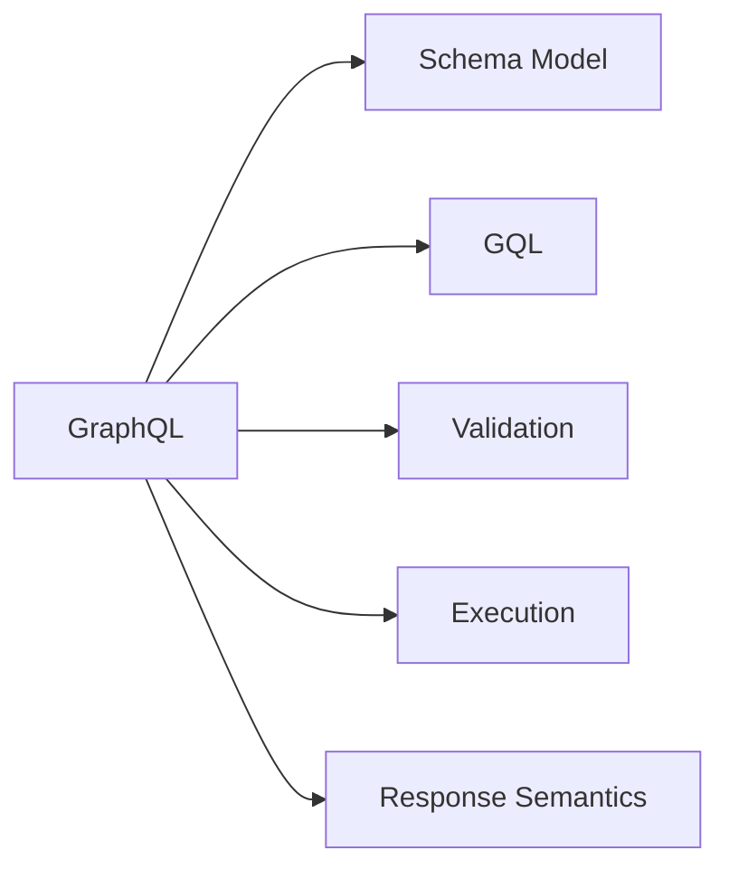

### 2. Schema

#### 2.1 GraphQL Schema

A GraphQL schema is the specification-defined, typed structure of an API: its types, fields, arguments, and root operation types.

The schema is required; SDL is not.

#### 2.2 Schema Model

The GraphQL specification defines an abstract schema model that all GraphQL schemas must conform to.

Implementations may represent that model internally however they want.

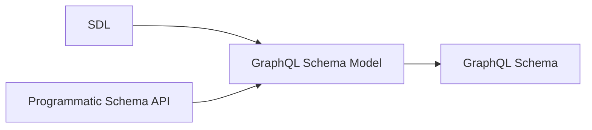

#### 2.3 SDL

SDL (Schema Definition Language) is GraphQL's standardized language for expressing the schema model.

A server does not have to accept SDL or use it internally.

A custom schema-definition mechanism is compatible with GraphQL if it produces a valid GraphQL schema.

SDL describes the GraphQL schema, not implementation details such as resolver code or database access.

### 3. Query Language (GQL)

#### 3.1 GQL Is Standardized

GQL is the actual GraphQL query language defined by the specification.

A GraphQL implementation must support GraphQL documents written in GQL; a server-specific query syntax is not a replacement for GQL.

#### 3.2 Basic Structure

```graphql
query GetUser($id: ID!) {
  user(id: $id) {
    id
    name
  }
}
```

| Syntax       | Meaning        |
| ------------ | -------------- |
| `query`      | Operation type |
| `GetUser`    | Operation name |
| `$id`        | Variable       |
| `user`       | Field          |
| `id`, `name` | Nested fields  |
| `{ ... }`    | Selection set  |

#### 3.3 Object vs. Leaf Fields

The return type of a field determines whether it can have a selection set.

| Return type | Selection set |
| ----------- | ------------- |
| Object      | Required      |
| Leaf type   | Forbidden     |

Scalars and enums are leaf types.

#### 3.4 The Important Asymmetry

| Schema                                            | GQL                                        |
| ------------------------------------------------- | ------------------------------------------ |
| GraphQL standardizes the schema model             | GraphQL standardizes the language itself   |
| Implementations may construct schemas differently | Implementations must support GQL semantics |
| SDL is one representation                         | Parsed representations may vary internally |

### 4. Request

#### 4.1 A GQL Document Is Not a Request

A GQL document describes an operation; a request submits that operation for execution.

A GraphQL request can provide:

* A document
* An operation selection
* Variable values

The GraphQL specification defines these concepts, but not a universal in-process API for passing them around.

#### 4.2 In-Process Request APIs

A library might expose an API such as:

```ts
execute({
  schema,
  document,
  variables
})
```

The API and in-memory representations are implementation-specific.

The `document` may be a parsed representation rather than GQL text, but it must faithfully represent a GraphQL document.

Variable values must satisfy the variable definitions in the document.

#### 4.3 Transport

GraphQL core does not require HTTP, a URL, JSON request bodies, or a particular endpoint.

A transport can deliver a request through HTTP, WebSockets, an in-process function call, or another mechanism.

#### 4.4 GraphQL over HTTP

GraphQL over HTTP is a separate standard for carrying GraphQL requests and responses over HTTP.

It is widely implemented, but HTTP is not required by core GraphQL.

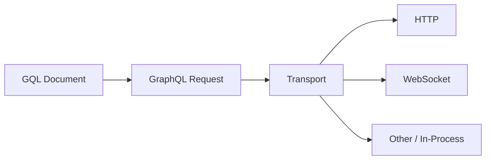

### 5. Execution

#### 5.1 What Execution Is

Execution evaluates a valid GraphQL operation against a schema according to GraphQL's execution semantics.

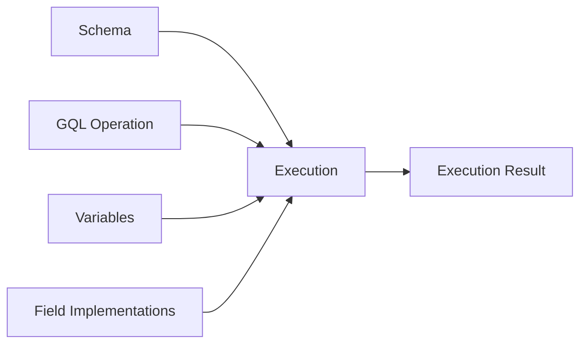

#### 5.2 What the Specification Defines

The specification defines how execution handles:

* Field selection
* Arguments and variables
* Nested selections
* Aliases and fragments
* Nullability
* Field errors
* Value completion

Different conforming execution engines should therefore have the same GraphQL-level semantics for equivalent inputs.

#### 5.3 What the Server Defines

GraphQL does not define how a field obtains its data.

A field may use a database, another service, a cache, or arbitrary application logic.

These application-specific implementations are commonly called **resolvers**.

| GraphQL specifies         | Server implements            |
| ------------------------- | ---------------------------- |
| How fields are executed   | What a field actually does   |
| How arguments are applied | How data is retrieved        |
| Nullability behavior      | Database/service interaction |
| Error propagation rules   | Application-specific errors  |

### 6. Response

#### 6.1 Execution Result

Execution produces a GraphQL result containing `data`, errors, or both as appropriate.

The `data` structure follows the selection structure of the operation.

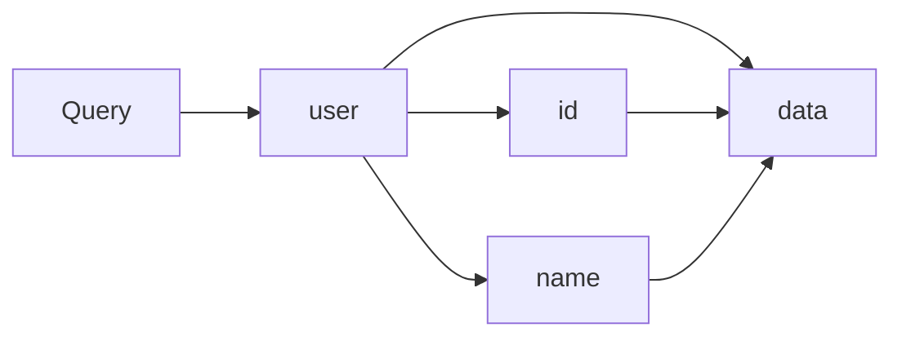

#### 6.2 Errors

GraphQL defines error semantics and a structured error representation.

An error contains at least `message` and may include `locations`, `path`, and `extensions`.

Errors are part of the GraphQL contract, not purely server-specific behavior.

#### 6.3 Response vs. Serialization

GraphQL defines the response structure and semantics; JSON is not the fundamental GraphQL data model.

JSON is a representation capable of carrying that structure.

The transport determines how the response is serialized and transmitted.

### 7. The Complete Boundary Map

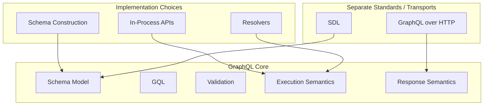

#### 7.1 What GraphQL Core Defines

| Area           | Core GraphQL        |
| -------------- | ------------------- |
| Schema         | Schema model        |
| Query language | GQL                 |
| Validation     | Validation rules    |
| Execution      | Execution semantics |
| Response       | Response semantics  |

#### 7.2 What Is Standardized Separately

| Component         | Role                                        |
| ----------------- | ------------------------------------------- |
| SDL               | Standard language for expressing schemas    |
| GraphQL over HTTP | Standard for transporting GraphQL over HTTP |

#### 7.3 What Is Implementation-Specific

* Schema construction
* Internal schema representation
* In-process request APIs
* Internal GQL representation
* Resolver implementations
* Database and service integration

#### 7.4 What Core GraphQL Does Not Require

* HTTP
* A `/graphql` endpoint
* JSON request bodies
* A specific programming language
* A specific server framework
* A specific database

### 8. Chapter 1 Summary

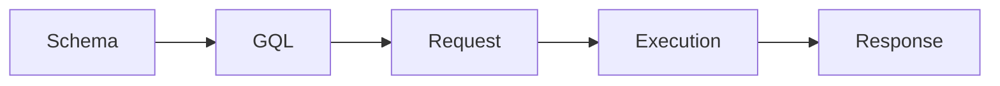

| Concept   | Standardized by GraphQL        | Flexible                              |
| --------- | ------------------------------ | ------------------------------------- |
| Schema    | Schema model                   | Construction and representation       |
| SDL       | SDL language                   | Whether the server accepts or uses it |
| GQL       | Language and semantics         | Parser and internal representation    |
| Request   | Request concepts and semantics | In-process API and transport          |
| Execution | Execution semantics            | Engine implementation and resolvers   |
| Response  | Response semantics             | Serialization and transport           |

The central asymmetry:

> **GraphQL standardizes the schema model, but it standardizes GQL itself as a language.**

The surrounding mechanisms can vary, provided their GraphQL behavior conforms to the specification.

## Chapter 2 — SDL and the Schema Model

### 1. SDL and the Schema Model

#### 1.1 GraphQL Schema

A GraphQL schema is a typed description of an API: its types, fields, arguments, directives, and root operation types.

#### 1.2 SDL as a Schema Representation

SDL (Schema Definition Language) is the standardized GraphQL language for describing a schema.

A server may accept SDL, construct the schema programmatically, or use another mechanism. The resulting schema must conform to the GraphQL Schema Model.

#### 1.3 Schema Model vs. Implementation

The Schema Model defines what the schema means; the implementation chooses how to represent and construct it.

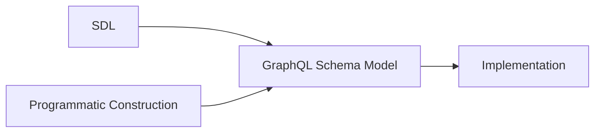

### 2. Object Types

#### 2.1 Object Type Definitions

An object type defines a set of fields:

```graphql
type User {
  id: ID!
  name: String!
}
```

`User` is the type name; `id` and `name` are fields.

#### 2.2 Field Definitions

A field definition has the form:

```graphql
name: Type
```

The type may be a named type or a type modified by `[]` and `!`.

```graphql
name: String!
posts: [Post!]!
```

#### 2.3 Object Type Relationships

An object field can use another object type:

```graphql
type Post {
  author: User!
}
```

This creates a relationship between `Post` and `User`.

#### 2.4 Object Type Extensions

An existing object type can be extended:

```graphql
type User {
  id: ID!
}

extend type User {
  name: String!
}
```

Extensions contribute to the existing type; they do not create another type.

### 3. Leaf Types

#### 3.1 Built-in Scalars

GraphQL defines five built-in scalar types:

| Scalar    | Represents            |
| --------- | --------------------- |
| `Int`     | Integer               |
| `Float`   | Floating-point number |
| `String`  | Text                  |
| `Boolean` | `true` or `false`     |
| `ID`      | Identifier            |

Scalars are leaf types, so they cannot have selection sets.

#### 3.2 Custom Scalars

A schema can define its own scalar types:

```graphql
scalar DateTime
```

This declares `DateTime` as a scalar; the implementation defines how its values are parsed and serialized.

#### 3.3 Scalar Extensions

A custom scalar can also be extended:

```graphql
scalar DateTime

extend scalar DateTime
```

The extension mechanism allows schema definitions to be assembled from multiple SDL documents.

#### 3.4 Enum Types

An enum is a leaf type whose value must be one of a fixed set of named values:

```graphql
enum PostSort {
  NEWEST
  OLDEST
  TOP
}
```

Enum names follow GraphQL `Name` syntax. Uppercase is a convention, not a requirement.

#### 3.5 Enum Extensions

An enum can be extended with additional values:

```graphql
enum PostSort {
  NEWEST
}

extend enum PostSort {
  TOP
}
```

### 4. Type Modifiers

#### 4.1 Non-Null

`!` wraps a type and disallows `null`.

```graphql
name: String!
```

For an output field, `!` means the value cannot be `null` when the field is selected.

For an input field, `!` also makes the field required: it cannot be omitted or set to `null`.

#### 4.2 Lists

`[]` wraps a type and makes it a list:

```graphql
posts: [Post]
```

A list may contain `null` elements unless its element type is Non-Null.

#### 4.3 Combining Type Modifiers

`[]` and `!` can be nested:

| Type       | Meaning                                 |
| ---------- | --------------------------------------- |
| `Post`     | Nullable `Post`                         |
| `Post!`    | Non-Null `Post`                         |
| `[Post]`   | Nullable list of nullable `Post` values |
| `[Post!]`  | Nullable list of Non-Null `Post` values |
| `[Post]!`  | Non-Null list of nullable `Post` values |
| `[Post!]!` | Non-Null list of Non-Null `Post` values |

### 5. Input Types

#### 5.1 Input Object Definitions

Input objects define structured values supplied to fields:

```graphql
input PostFilter {
  topicId: ID!
  sort: PostSort
}
```

#### 5.2 Input Fields

Input fields use the same type syntax as output fields, but must use input types.

An input field is nullable and optional by default.

`!` makes it required.

#### 5.3 Input vs. Output Types

|             | Input types                   | Output types                                |
| ----------- | ----------------------------- | ------------------------------------------- |
| Used for    | Values supplied to fields     | Values returned by fields                   |
| May contain | Scalars, enums, input objects | Scalars, enums, objects, interfaces, unions |
| Example     | `input PostFilter`            | `type Post`                                 |

#### 5.4 Input Cycles

Input objects may reference one another, but a cycle consisting only of required singular fields is invalid because no finite value can satisfy it.

```graphql
input A {
  b: B!
}

input B {
  a: A!
}
```

#### 5.5 Input Object Extensions

Input objects can be extended:

```graphql
input PostFilter {
  topicId: ID!
}

extend input PostFilter {
  sort: PostSort
}
```

#### 5.6 Arguments

Arguments belong to field definitions:

```graphql
type Query {
  post(id: ID!): Post
}
```

`id` is an argument; `post` is a field.

#### 5.7 Default Values

Arguments and input fields can have default values:

```graphql
type Query {
  posts(limit: Int = 20): [Post!]!
}
```

The default is used when the value is omitted.

### 6. Interfaces and Unions

#### 6.1 Interfaces

An interface defines fields that implementing types must provide:

```graphql
interface Content {
  id: ID!
}
```

#### 6.2 Interface Implementation

An object implements an interface with `implements`:

```graphql
type Post implements Content {
  id: ID!
  title: String!
}
```

`implements` establishes a conformance relationship; it does not inherit fields.

#### 6.3 Multiple Interface Implementations

An object can implement multiple interfaces. Their names are separated by `&`:

```graphql
type Post implements Content & Postable {
  id: ID!
  author: User!
  title: String!
}
```

The object must satisfy every interface it declares.

An interface can also implement multiple interfaces using the same syntax.

#### 6.4 Interfaces Implementing Interfaces

Interfaces can implement other interfaces:

```graphql
interface Content {
  id: ID!
}

interface Postable implements Content {
  id: ID!
  author: User!
}
```

The implementing interface must satisfy the interface contract.

#### 6.5 Interface Extensions

Interfaces can be extended:

```graphql
interface Content {
  id: ID!
}

extend interface Content {
  author: User!
}
```

#### 6.6 Unions

A union represents one of several object types:

```graphql
union SearchResult = Post | Comment
```

A union defines possible object types but has no fields of its own.

#### 6.7 Union Extensions

A union can be extended with additional object types:

```graphql
union SearchResult = Post

extend union SearchResult = Comment
```

### 7. Directives

#### 7.1 Directive Definitions

A directive definition declares its name, arguments, whether it is repeatable, and its allowed locations:

```graphql
directive @auth(role: String!) on FIELD_DEFINITION
```

The general form is:

```graphql
directive @name(arguments) repeatable? on LOCATION | LOCATION | ...
```

#### 7.2 Directive Applications

A directive is applied by placing `@name` after the construct at an allowed location:

```graphql
type Post @auth(role: "admin") {
  title: String!
}
```

The directive's definition determines whether that location is valid and which arguments it accepts.

#### 7.3 Directive Arguments and Defaults

Directive arguments use input types and may have default values:

```graphql
directive @tag(name: String = "default") on FIELD_DEFINITION
```

#### 7.4 Directive Locations

The `on` clause specifies where the directive may be used. Multiple locations are separated by `|`.

```graphql
directive @foo on FIELD_DEFINITION | OBJECT | INPUT_FIELD_DEFINITION
```

This means `@foo` may be used on object fields, object type definitions, or input fields.

GraphQL defines a fixed set of directive locations.

**Schema locations:**

| Location                 | Applies to                             |
| ------------------------ | -------------------------------------- |
| `SCHEMA`                 | Schema definition                      |
| `SCALAR`                 | Scalar definition                      |
| `OBJECT`                 | Object type definition                 |
| `FIELD_DEFINITION`       | Object or interface field definition   |
| `ARGUMENT_DEFINITION`    | Field or directive argument definition |
| `INTERFACE`              | Interface definition                   |
| `UNION`                  | Union definition                       |
| `ENUM`                   | Enum definition                        |
| `ENUM_VALUE`             | Enum value                             |
| `INPUT_OBJECT`           | Input object definition                |
| `INPUT_FIELD_DEFINITION` | Input object field definition          |

**Executable GQL locations:**

| Location          | Applies to            |
| ----------------- | --------------------- |
| `FIELD`           | Field selection       |
| `FRAGMENT_SPREAD` | Named fragment spread |
| `INLINE_FRAGMENT` | Inline fragment       |

A directive applied at a location not declared by its definition is invalid. ([spec.graphql.org](https://spec.graphql.org/September2025/))

#### 7.5 Repeatable Directives

A directive can be declared `repeatable`:

```graphql
directive @tag(name: String!) repeatable on FIELD_DEFINITION
```

Without `repeatable`, the same directive may not be applied more than once at the same location. With it, multiple applications are allowed.

For example:

```graphql
type Post {
  title: String!
    @tag(name: "searchable")
    @tag(name: "indexed")
}
```

#### 7.6 Built-in Directives

GraphQL defines five built-in directives:

| Directive      | Locations                                                                         | Purpose                                           |
| -------------- | --------------------------------------------------------------------------------- | ------------------------------------------------- |
| `@skip`        | `FIELD`, `FRAGMENT_SPREAD`, `INLINE_FRAGMENT`                                     | Skip a selection when `if` is `true`              |
| `@include`     | `FIELD`, `FRAGMENT_SPREAD`, `INLINE_FRAGMENT`                                     | Include a selection only when `if` is `true`      |
| `@deprecated`  | `FIELD_DEFINITION`, `ARGUMENT_DEFINITION`, `INPUT_FIELD_DEFINITION`, `ENUM_VALUE` | Mark a schema element as deprecated               |
| `@specifiedBy` | `SCALAR`                                                                          | Associate a scalar with an external specification |
| `@oneOf`       | `INPUT_OBJECT`                                                                    | Require exactly one input field to be supplied    |

Their definitions and behavior are standardized by GraphQL. ([spec.graphql.org](https://spec.graphql.org/September2025/))

For example:

```graphql
input PostTarget @oneOf {
  postId: ID
  commentId: ID
}
```

`@oneOf` applies to the input object itself. Exactly one of its fields must be supplied.

### 8. Schema Definitions

#### 8.1 Schema Definition

A schema can explicitly define its root operation mappings:

```graphql
schema {
  query: Query
  mutation: Mutation
  subscription: Subscription
}
```

There is at most one base `schema` definition in an assembled schema.

#### 8.2 Root Operation Mappings

A schema definition maps operation types to object types:

```graphql
schema {
  query: RootQuery
}
```

The operation types are `query`, `mutation`, and `subscription`; their mapped types must be object types.

If the schema uses the conventional root type names `Query`, `Mutation`, and `Subscription`, the explicit `schema` definition may be omitted.

The omission is shorthand for the corresponding mappings; it does not create special types.

#### 8.3 Schema Extensions

A schema can be extended:

```graphql
schema {
  query: Query
}

extend schema {
  mutation: Mutation
}
```

Multiple schema extensions may be assembled into the same schema.

#### 8.4 The Single Schema Definition Rule

One assembled schema may contain at most one base `schema` definition. Its root mappings must not be defined again by another base `schema` definition.

### 9. SDL Source Syntax

#### 9.1 Names

GraphQL names begin with `_` or an ASCII letter and may then contain `_`, letters, and digits:

```text
[_A-Za-z][_0-9A-Za-z]*
```

Names are used for types, fields, arguments, directives, enum values, and other schema elements.

#### 9.2 Descriptions

Descriptions are part of the GraphQL type system and can be attached to schema elements using string literals:

```graphql
"""A user of the platform."""
type User {
  """The user's display name."""
  name: String!
}
```

Descriptions can be provided for types, fields, arguments, input fields, enum values, and directives.

They are exposed through introspection and do not affect execution behavior.

#### 9.3 Comments

Comments begin with `#` and continue to the end of the line:

```graphql
# A user of the platform.
type User {
  id: ID!
}
```

Comments are ignored by the parser.

#### 9.4 Whitespace

Whitespace separates tokens but does not otherwise determine structure. Indentation and line breaks are not significant.

#### 9.5 Commas

Commas are optional and insignificant:

```graphql
type User {
  id: ID!,
  name: String!
}
```

is equivalent to:

```graphql
type User {
  id: ID!
  name: String!
}
```

#### 9.6 Lexical Tokens

SDL is parsed as a sequence of tokens. Whitespace can be necessary to separate tokens, but the parser does not rely on indentation or line structure.

For example:

```graphql
type User {
  id: ID!
  name: String!
}
```

The `name` token begins the next field because of its position in the grammar, while `@` after a field type begins a directive attached to that field.

GraphQL source is tokenized before parsing. Whitespace and comments separate tokens but do not define structural nesting.

Names use:

```text
[_A-Za-z][_0-9A-Za-z]*
```

Punctuators such as `@`, `|`, `&`, `[`, `]`, `{`, `}`, `(`, `)`, `:`, and `!` have defined grammatical meanings.


### 10. Schema Construction and Validation

#### 10.1 Parsing SDL

Parsing checks whether an SDL document follows GraphQL's grammar.

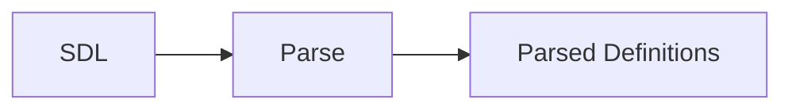

A parsed document is not necessarily a valid schema.

#### 10.2 Schema Assembly

Multiple parsed documents can be combined into one schema.

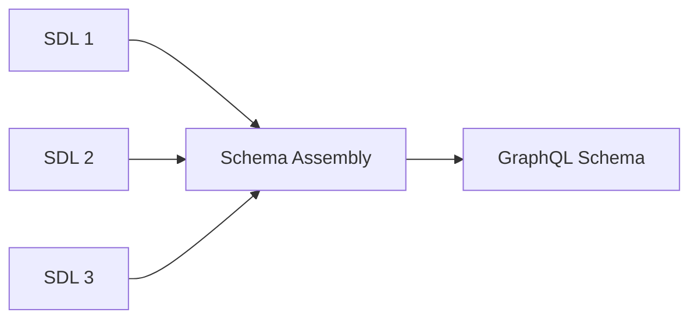

SDL has no file-level visibility model; the assembler determines which definitions belong to the same schema.

#### 10.3 Declaration Order

Definitions are not interpreted as sequential execution statements. References can point to definitions that appear later in the same schema document or in another assembled document.

```graphql
type Post {
  author: User
}

type User {
  id: ID!
}
```

This is valid.

#### 10.4 Cross-Document Assembly

Definitions in different SDL documents can contribute to the same schema:

```graphql
# user.graphql
type User {
  id: ID!
}
```

```graphql
# profile.graphql
extend type User {
  avatar: String
}
```

If both documents are assembled into one schema, `User` contains both fields.

#### 10.5 Schema Validation

Schema validation checks the assembled schema against GraphQL's type-system rules.

Examples include:

* A referenced type must exist.
* A field name must be unique within its type.
* An object implementing an interface must satisfy its fields.
* A union member must be an object type.
* Input positions must use input types.
* Extensions must be compatible with the type they extend.
* Directives must be used at allowed locations.
* Required input cycles are invalid.

### 11. GraphQL Schema Model

#### 11.1 SDL → Schema Model

SDL is a standardized representation of the GraphQL Schema Model.

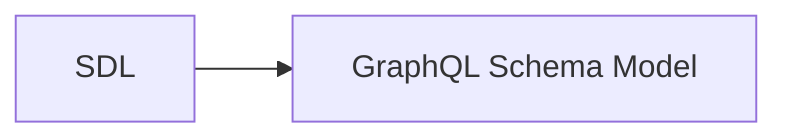

#### 11.2 Alternative Schema Construction

SDL is not required as the mechanism for constructing a schema. An implementation may construct the same model programmatically or through another mechanism.

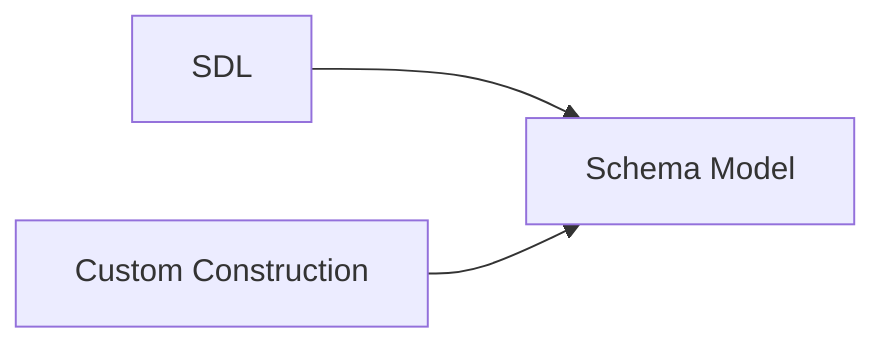

#### 11.3 Schema Model → Implementation

The implementation turns the schema model into whatever internal representation is needed for validation, execution, introspection, and other server functionality.

The internal representation is not standardized.

#### 11.4 Portable vs. Implementation-Specific

| Portable               | Implementation-specific        |
| ---------------------- | ------------------------------ |
| GraphQL Schema Model   | Internal schema representation |
| SDL representation     | Schema construction API        |
| GQL against the schema | Resolver implementation        |
| Schema semantics       | Server architecture            |

**Core idea:** SDL defines the GraphQL schema; the implementation decides how that schema is constructed and represented.

Yes. There was substantial repetition in the draft, particularly around schema-defined validity, fragments, and variables. I also had several sections that restated distinctions already established rather than adding reference value.

The biggest reductions are:

* Remove repeated explanations of fields being schema-defined.
* Collapse basic selection-set material.
* Treat literal values as a compact syntax reference rather than re-explaining their typing.
* Combine variable rules instead of separately restating compatibility/default behavior.
* Reduce fragment sections to the distinctions that matter: named vs. inline, type conditions, composition/cycles.
* Remove the final "GraphQL and the Schema" section because it largely repeats Chapter 2.
* Remove the final mental-model section's repetition of the chapter; retain only a compact summary.

The resulting chapter should be closer to this:

## Chapter 3 — GraphQL Query Language

### 1. Documents and Operations

#### 1.1 Documents

A GraphQL document contains operation definitions and fragment definitions.

#### 1.2 Operations

An operation is an executable unit:

```graphql
query { ... }
mutation { ... }
subscription { ... }
```

The operation type determines its execution semantics.

#### 1.3 Named and Anonymous Operations

Operations may be named:

```graphql
query GetUser {
  user(id: "123") {
    name
  }
}
```

or anonymous:

```graphql
{
  user(id: "123") {
    name
  }
}
```

An anonymous operation is allowed only when the document contains one operation.

A document containing multiple operations requires the request to identify the operation by name.

### 2. Selection Sets

#### 2.1 Fields and Nested Selections

A selection set contains fields, with nested selection sets for object-valued fields:

```graphql
query {
  post(id: "123") {
    title
    author {
      name
    }
  }
}
```

The available selections are determined by the schema type at each level.

#### 2.2 Arguments

Fields may provide arguments:

```graphql
posts(topicId: "42", limit: 20) {
  title
}
```

Arguments supply values to arguments declared by the schema.

### 3. Values and Variables

#### 3.1 Value Literals

GraphQL supports these literal value forms:

| Value        | Example             |
| ------------ | ------------------- |
| Int          | `20`                |
| Float        | `3.14`              |
| String       | `"text"`            |
| Boolean      | `true`              |
| Null         | `null`              |
| Enum         | `NEWEST`            |
| List         | `["a", "b"]`        |
| Input object | `{ topicId: "42" }` |

The expected schema type determines whether a literal is valid.

#### 3.2 Variables

Variables provide values separately from the document:

```graphql
query GetPosts($limit: Int!) {
  posts(limit: $limit) {
    id
  }
}
```

Variables are declared on the operation and supplied by the request.

#### 3.3 Variable Defaults

Variables may have defaults:

```graphql
query GetPosts($limit: Int! = 20) {
  posts(limit: $limit) {
    id
  }
}
```

The default is used when the variable is not provided.

#### 3.4 Variable Type Compatibility

A variable can only be used where its declared type is compatible with the argument's type. This is validated before execution.

### 4. Aliases and Field Merging

#### 4.1 Aliases

An alias changes a field's response name without changing the field selected:

```graphql
{
  displayName: name
}
```

#### 4.2 Field Merging

Selections with the same response name are merged when their field and arguments are compatible:

```graphql
{
  posts(sort: NEWEST) {
    id
  }

  posts(sort: NEWEST) {
    title
  }
}
```

Conceptually:

```graphql
{
  posts(sort: NEWEST) {
    id
    title
  }
}
```

Argument order does not matter.

#### 4.3 Field Conflicts

Selections with the same response name but incompatible fields or arguments produce a validation error.

Aliases can give them different response names.

### 5. Fragments

#### 5.1 Named Fragments

A named fragment defines a reusable selection set:

```graphql
fragment UserFields on User {
  id
  name
}
```

It is included with a fragment spread:

```graphql
user(id: "123") {
  ...UserFields
}
```

#### 5.2 Inline Fragments

An inline fragment provides type-specific selections without defining a reusable fragment:

```graphql
search {
  ... on Post {
    title
  }
}
```

#### 5.3 Type Conditions

`on Type` is a type condition. The fragment's selections apply when the current value is compatible with that type.

Object, interface, and union types can be used as type conditions.

#### 5.4 Fragment Composition

Fragments can spread other fragments. Fragment spreads must be type-compatible with their location and must not form cycles.

### 6. Directives

#### 6.1 Directive Applications

Directives are applied with `@` and may take arguments:

```graphql
name @include(if: $showName)
```

The directive definition determines where it may be used and what arguments it accepts.

#### 6.2 Built-in Execution Directives

`@skip` omits a selection when `if` is true.

`@include` includes a selection only when `if` is true.

Both can apply to fields, fragment spreads, and inline fragments.

#### 6.3 Type Selection vs. Runtime Conditions

| Mechanism            | Based on             |
| -------------------- | -------------------- |
| Inline fragment      | Current GraphQL type |
| `@include` / `@skip` | Runtime Boolean      |

An inline fragment is type-directed selection, not general conditional control flow.

### 7. Syntax Details

#### 7.1 Names and Keywords

GraphQL names begin with `_` or an ASCII letter and may then contain `_`, letters, and digits.

`query`, `mutation`, and `subscription` are operation-type keywords.

#### 7.2 Whitespace, Commas, and Comments

Whitespace and line breaks do not determine structure. Commas are optional and insignificant. Comments begin with `#` and run to the end of the line.

### 8. GQL and the Schema

#### 8.1 Schema-Defined Validity

The schema determines which fields, arguments, and types are valid in a GraphQL document.

#### 8.2 Parsing vs. Validation

Parsing checks GraphQL syntax. Validation checks whether the parsed document is valid against the schema.

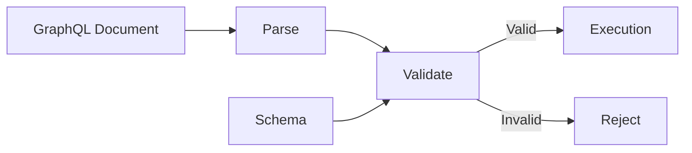

### 9. Chapter Summary

GraphQL query language is a declarative language for selecting data from a schema.

| Construct      | Purpose                               |
| -------------- | ------------------------------------- |
| Operation      | Defines an executable operation       |
| Selection set  | Selects fields                        |
| Argument       | Supplies a field input                |
| Variable       | Supplies runtime input                |
| Alias          | Changes a response name               |
| Fragment       | Reuses selections                     |
| Type condition | Restricts fragment selections by type |
| Directive      | Modifies an executable construct      |

The document describes **what is requested**; execution determines **what that request does**.
