# The Minimalist Guide to GraphQL

## Chapter 1 — The Core Model and Its Boundaries

### 1. What Is GraphQL?

GraphQL is a specification for a typed API. It defines a schema model, the GraphQL query language (GQL), validation, execution semantics, and response semantics.

It does not require a particular transport, server framework, database, or resolver implementation.

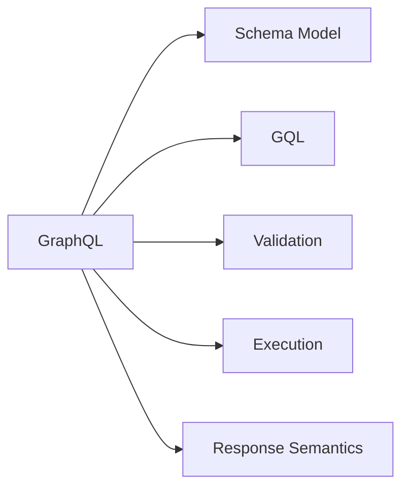

### 2. Schema

#### 2.1 GraphQL Schema

A GraphQL schema is the specification-defined, typed structure of an API: its types, fields, arguments, and root operation types.

The schema is required; SDL is not.

#### 2.2 Schema Model

The GraphQL specification defines an abstract schema model that all GraphQL schemas must conform to.

Implementations may represent that model internally however they want.

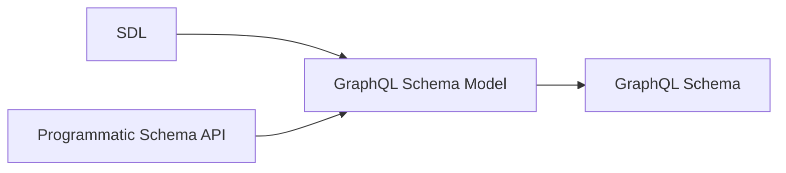

#### 2.3 SDL

SDL (Schema Definition Language) is GraphQL's standardized language for expressing the schema model.

A server does not have to accept SDL or use it internally.

A custom schema-definition mechanism is compatible with GraphQL if it produces a valid GraphQL schema.

SDL describes the GraphQL schema, not implementation details such as resolver code or database access.

### 3. Query Language (GQL)

#### 3.1 GQL Is Standardized

GQL is the actual GraphQL query language defined by the specification.

A GraphQL implementation must support GraphQL documents written in GQL; a server-specific query syntax is not a replacement for GQL.

#### 3.2 Basic Structure

```graphql
query GetUser($id: ID!) {
  user(id: $id) {
    id
    name
  }
}
```

| Syntax       | Meaning        |
| ------------ | -------------- |
| `query`      | Operation type |
| `GetUser`    | Operation name |
| `$id`        | Variable       |
| `user`       | Field          |
| `id`, `name` | Nested fields  |
| `{ ... }`    | Selection set  |

#### 3.3 Object vs. Leaf Fields

The return type of a field determines whether it can have a selection set.

| Return type | Selection set |
| ----------- | ------------- |
| Object      | Required      |
| Leaf type   | Forbidden     |

Scalars and enums are leaf types.

#### 3.4 The Important Asymmetry

| Schema                                            | GQL                                        |
| ------------------------------------------------- | ------------------------------------------ |
| GraphQL standardizes the schema model             | GraphQL standardizes the language itself   |
| Implementations may construct schemas differently | Implementations must support GQL semantics |
| SDL is one representation                         | Parsed representations may vary internally |

### 4. Request

#### 4.1 A GQL Document Is Not a Request

A GQL document describes an operation; a request submits that operation for execution.

A GraphQL request can provide:

* A document
* An operation selection
* Variable values

The GraphQL specification defines these concepts, but not a universal in-process API for passing them around.

#### 4.2 In-Process Request APIs

A library might expose an API such as:

```ts
execute({
  schema,
  document,
  variables
})
```

The API and in-memory representations are implementation-specific.

The `document` may be a parsed representation rather than GQL text, but it must faithfully represent a GraphQL document.

Variable values must satisfy the variable definitions in the document.

#### 4.3 Transport

GraphQL core does not require HTTP, a URL, JSON request bodies, or a particular endpoint.

A transport can deliver a request through HTTP, WebSockets, an in-process function call, or another mechanism.

#### 4.4 GraphQL over HTTP

GraphQL over HTTP is a separate standard for carrying GraphQL requests and responses over HTTP.

It is widely implemented, but HTTP is not required by core GraphQL.

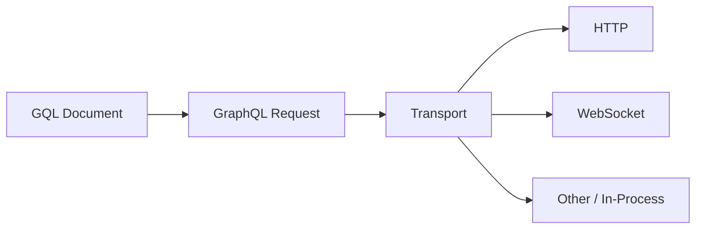

### 5. Execution

#### 5.1 What Execution Is

Execution evaluates a valid GraphQL operation against a schema according to GraphQL's execution semantics.

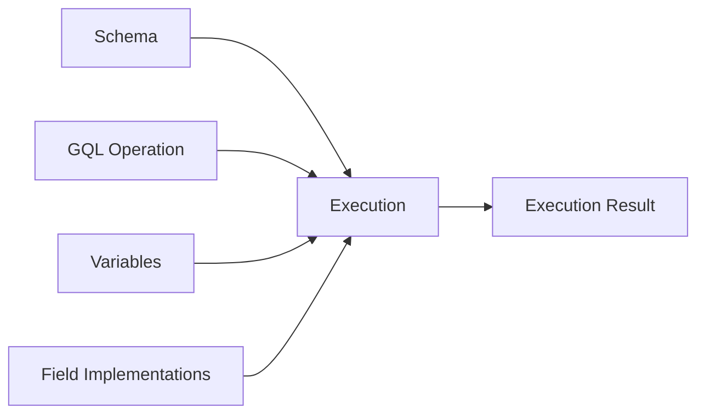

#### 5.2 What the Specification Defines

The specification defines how execution handles:

* Field selection
* Arguments and variables
* Nested selections
* Aliases and fragments
* Nullability
* Field errors
* Value completion

Different conforming execution engines should therefore have the same GraphQL-level semantics for equivalent inputs.

#### 5.3 What the Server Defines

GraphQL does not define how a field obtains its data.

A field may use a database, another service, a cache, or arbitrary application logic.

These application-specific implementations are commonly called **resolvers**.

| GraphQL specifies         | Server implements            |
| ------------------------- | ---------------------------- |
| How fields are executed   | What a field actually does   |
| How arguments are applied | How data is retrieved        |
| Nullability behavior      | Database/service interaction |
| Error propagation rules   | Application-specific errors  |

### 6. Response

#### 6.1 Execution Result

Execution produces a GraphQL result containing `data`, errors, or both as appropriate.

The `data` structure follows the selection structure of the operation.

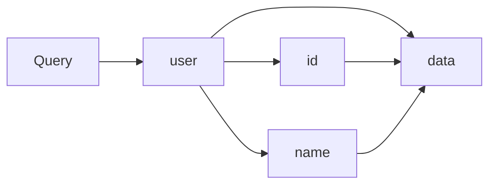

#### 6.2 Errors

GraphQL defines error semantics and a structured error representation.

An error contains at least `message` and may include `locations`, `path`, and `extensions`.

Errors are part of the GraphQL contract, not purely server-specific behavior.

#### 6.3 Response vs. Serialization

GraphQL defines the response structure and semantics; JSON is not the fundamental GraphQL data model.

JSON is a representation capable of carrying that structure.

The transport determines how the response is serialized and transmitted.

### 7. The Complete Boundary Map

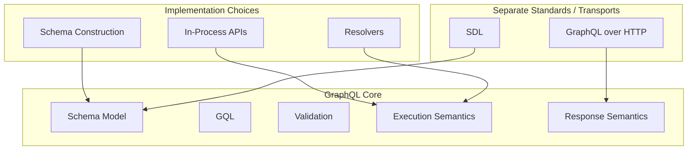

#### 7.1 What GraphQL Core Defines

| Area           | Core GraphQL        |
| -------------- | ------------------- |
| Schema         | Schema model        |
| Query language | GQL                 |
| Validation     | Validation rules    |
| Execution      | Execution semantics |
| Response       | Response semantics  |

#### 7.2 What Is Standardized Separately

| Component         | Role                                        |
| ----------------- | ------------------------------------------- |
| SDL               | Standard language for expressing schemas    |
| GraphQL over HTTP | Standard for transporting GraphQL over HTTP |

#### 7.3 What Is Implementation-Specific

* Schema construction
* Internal schema representation
* In-process request APIs
* Internal GQL representation
* Resolver implementations
* Database and service integration

#### 7.4 What Core GraphQL Does Not Require

* HTTP
* A `/graphql` endpoint
* JSON request bodies
* A specific programming language
* A specific server framework
* A specific database

### 8. Chapter 1 Summary

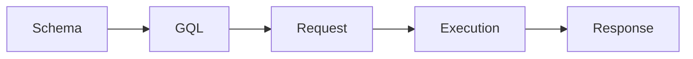

| Concept   | Standardized by GraphQL        | Flexible                              |
| --------- | ------------------------------ | ------------------------------------- |
| Schema    | Schema model                   | Construction and representation       |
| SDL       | SDL language                   | Whether the server accepts or uses it |
| GQL       | Language and semantics         | Parser and internal representation    |
| Request   | Request concepts and semantics | In-process API and transport          |
| Execution | Execution semantics            | Engine implementation and resolvers   |
| Response  | Response semantics             | Serialization and transport           |

The central asymmetry:

> **GraphQL standardizes the schema model, but it standardizes GQL itself as a language.**

The surrounding mechanisms can vary, provided their GraphQL behavior conforms to the specification.

## Chapter 2 — SDL and the Schema Model

### 1. SDL and the Schema Model

#### 1.1 GraphQL Schema

A GraphQL schema is a typed description of an API: its types, fields, arguments, directives, and root operation types.

#### 1.2 SDL as a Schema Representation

SDL (Schema Definition Language) is the standardized GraphQL language for describing a schema.

A server may accept SDL, construct the schema programmatically, or use another mechanism. The resulting schema must conform to the GraphQL Schema Model.

#### 1.3 Schema Model vs. Implementation

The Schema Model defines what the schema means; the implementation chooses how to represent and construct it.

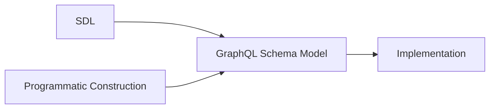

### 2. Object Types

#### 2.1 Object Type Definitions

An object type defines a set of fields:

```graphql
type User {
  id: ID!
  name: String!
}
```

`User` is the type name; `id` and `name` are fields.

#### 2.2 Field Definitions

A field definition has the form:

```graphql
name: Type
```

The type may be a named type or a type modified by `[]` and `!`.

```graphql
name: String!
posts: [Post!]!
```

#### 2.3 Object Type Relationships

An object field can use another object type:

```graphql
type Post {
  author: User!
}
```

This creates a relationship between `Post` and `User`.

#### 2.4 Object Type Extensions

An existing object type can be extended:

```graphql
type User {
  id: ID!
}

extend type User {
  name: String!
}
```

Extensions contribute to the existing type; they do not create another type.

### 3. Leaf Types

#### 3.1 Built-in Scalars

GraphQL defines five built-in scalar types:

| Scalar    | Represents            |
| --------- | --------------------- |
| `Int`     | Integer               |
| `Float`   | Floating-point number |
| `String`  | Text                  |
| `Boolean` | `true` or `false`     |
| `ID`      | Identifier            |

Scalars are leaf types, so they cannot have selection sets.

#### 3.2 Custom Scalars

A schema can define its own scalar types:

```graphql
scalar DateTime
```

This declares `DateTime` as a scalar; the implementation defines how its values are parsed and serialized.

#### 3.3 Scalar Extensions

A custom scalar can also be extended:

```graphql
scalar DateTime

extend scalar DateTime
```

The extension mechanism allows schema definitions to be assembled from multiple SDL documents.

#### 3.4 Enum Types

An enum is a leaf type whose value must be one of a fixed set of named values:

```graphql
enum PostSort {
  NEWEST
  OLDEST
  TOP
}
```

Enum names follow GraphQL `Name` syntax. Uppercase is a convention, not a requirement.

#### 3.5 Enum Extensions

An enum can be extended with additional values:

```graphql
enum PostSort {
  NEWEST
}

extend enum PostSort {
  TOP
}
```

### 4. Type Modifiers

#### 4.1 Non-Null

`!` wraps a type and disallows `null`.

```graphql
name: String!
```

For an output field, `!` means the value cannot be `null` when the field is selected.

For an input field, `!` also makes the field required: it cannot be omitted or set to `null`.

#### 4.2 Lists

`[]` wraps a type and makes it a list:

```graphql
posts: [Post]
```

A list may contain `null` elements unless its element type is Non-Null.

#### 4.3 Combining Type Modifiers

`[]` and `!` can be nested:

| Type       | Meaning                                 |
| ---------- | --------------------------------------- |
| `Post`     | Nullable `Post`                         |
| `Post!`    | Non-Null `Post`                         |
| `[Post]`   | Nullable list of nullable `Post` values |
| `[Post!]`  | Nullable list of Non-Null `Post` values |
| `[Post]!`  | Non-Null list of nullable `Post` values |
| `[Post!]!` | Non-Null list of Non-Null `Post` values |

### 5. Input Types

#### 5.1 Input Object Definitions

Input objects define structured values supplied to fields:

```graphql
input PostFilter {
  topicId: ID!
  sort: PostSort
}
```

#### 5.2 Input Fields

Input fields use the same type syntax as output fields, but must use input types.

An input field is nullable and optional by default.

`!` makes it required.

#### 5.3 Input vs. Output Types

|             | Input types                   | Output types                                |
| ----------- | ----------------------------- | ------------------------------------------- |
| Used for    | Values supplied to fields     | Values returned by fields                   |
| May contain | Scalars, enums, input objects | Scalars, enums, objects, interfaces, unions |
| Example     | `input PostFilter`            | `type Post`                                 |

#### 5.4 Input Cycles

Input objects may reference one another, but a cycle consisting only of required singular fields is invalid because no finite value can satisfy it.

```graphql
input A {
  b: B!
}

input B {
  a: A!
}
```

#### 5.5 Input Object Extensions

Input objects can be extended:

```graphql
input PostFilter {
  topicId: ID!
}

extend input PostFilter {
  sort: PostSort
}
```

#### 5.6 Arguments

Arguments belong to field definitions:

```graphql
type Query {
  post(id: ID!): Post
}
```

`id` is an argument; `post` is a field.

#### 5.7 Default Values

Arguments and input fields can have default values:

```graphql
type Query {
  posts(limit: Int = 20): [Post!]!
}
```

The default is used when the value is omitted.

### 6. Interfaces and Unions

#### 6.1 Interfaces

An interface defines fields that implementing types must provide:

```graphql
interface Content {
  id: ID!
}
```

#### 6.2 Interface Implementation

An object implements an interface with `implements`:

```graphql
type Post implements Content {
  id: ID!
  title: String!
}
```

`implements` establishes a conformance relationship; it does not inherit fields.

#### 6.3 Multiple Interface Implementations

An object can implement multiple interfaces. Their names are separated by `&`:

```graphql
type Post implements Content & Postable {
  id: ID!
  author: User!
  title: String!
}
```

The object must satisfy every interface it declares.

An interface can also implement multiple interfaces using the same syntax.

#### 6.4 Interfaces Implementing Interfaces

Interfaces can implement other interfaces:

```graphql
interface Content {
  id: ID!
}

interface Postable implements Content {
  id: ID!
  author: User!
}
```

The implementing interface must satisfy the interface contract.

#### 6.5 Interface Extensions

Interfaces can be extended:

```graphql
interface Content {
  id: ID!
}

extend interface Content {
  author: User!
}
```

#### 6.6 Unions

A union represents one of several object types:

```graphql
union SearchResult = Post | Comment
```

A union defines possible object types but has no fields of its own.

#### 6.7 Union Extensions

A union can be extended with additional object types:

```graphql
union SearchResult = Post

extend union SearchResult = Comment
```

### 7. Directives

#### 7.1 Directive Definitions

A directive definition declares its name, arguments, whether it is repeatable, and its allowed locations:

```graphql
directive @auth(role: String!) on FIELD_DEFINITION
```

The general form is:

```graphql
directive @name(arguments) repeatable? on LOCATION | LOCATION | ...
```

#### 7.2 Directive Applications

A directive is applied by placing `@name` after the construct at an allowed location:

```graphql
type Post @auth(role: "admin") {
  title: String!
}
```

The directive's definition determines whether that location is valid and which arguments it accepts.

#### 7.3 Directive Arguments and Defaults

Directive arguments use input types and may have default values:

```graphql
directive @tag(name: String = "default") on FIELD_DEFINITION
```

#### 7.4 Directive Locations

The `on` clause specifies where the directive may be used. Multiple locations are separated by `|`.

```graphql
directive @foo on FIELD_DEFINITION | OBJECT | INPUT_FIELD_DEFINITION
```

This means `@foo` may be used on object fields, object type definitions, or input fields.

GraphQL defines a fixed set of directive locations.

**Schema locations:**

| Location                 | Applies to                             |
| ------------------------ | -------------------------------------- |
| `SCHEMA`                 | Schema definition                      |
| `SCALAR`                 | Scalar definition                      |
| `OBJECT`                 | Object type definition                 |
| `FIELD_DEFINITION`       | Object or interface field definition   |
| `ARGUMENT_DEFINITION`    | Field or directive argument definition |
| `INTERFACE`              | Interface definition                   |
| `UNION`                  | Union definition                       |
| `ENUM`                   | Enum definition                        |
| `ENUM_VALUE`             | Enum value                             |
| `INPUT_OBJECT`           | Input object definition                |
| `INPUT_FIELD_DEFINITION` | Input object field definition          |

**Executable GQL locations:**

| Location          | Applies to            |
| ----------------- | --------------------- |
| `FIELD`           | Field selection       |
| `FRAGMENT_SPREAD` | Named fragment spread |
| `INLINE_FRAGMENT` | Inline fragment       |

A directive applied at a location not declared by its definition is invalid. ([spec.graphql.org](https://spec.graphql.org/September2025/))

#### 7.5 Repeatable Directives

A directive can be declared `repeatable`:

```graphql
directive @tag(name: String!) repeatable on FIELD_DEFINITION
```

Without `repeatable`, the same directive may not be applied more than once at the same location. With it, multiple applications are allowed.

For example:

```graphql
type Post {
  title: String!
    @tag(name: "searchable")
    @tag(name: "indexed")
}
```

#### 7.6 Built-in Directives

GraphQL defines five built-in directives:

| Directive      | Locations                                                                         | Purpose                                           |
| -------------- | --------------------------------------------------------------------------------- | ------------------------------------------------- |
| `@skip`        | `FIELD`, `FRAGMENT_SPREAD`, `INLINE_FRAGMENT`                                     | Skip a selection when `if` is `true`              |
| `@include`     | `FIELD`, `FRAGMENT_SPREAD`, `INLINE_FRAGMENT`                                     | Include a selection only when `if` is `true`      |
| `@deprecated`  | `FIELD_DEFINITION`, `ARGUMENT_DEFINITION`, `INPUT_FIELD_DEFINITION`, `ENUM_VALUE` | Mark a schema element as deprecated               |
| `@specifiedBy` | `SCALAR`                                                                          | Associate a scalar with an external specification |
| `@oneOf`       | `INPUT_OBJECT`                                                                    | Require exactly one input field to be supplied    |

Their definitions and behavior are standardized by GraphQL. ([spec.graphql.org](https://spec.graphql.org/September2025/))

For example:

```graphql
input PostTarget @oneOf {
  postId: ID
  commentId: ID
}
```

`@oneOf` applies to the input object itself. Exactly one of its fields must be supplied.

### 8. Schema Definitions

#### 8.1 Schema Definition

A schema can explicitly define its root operation mappings:

```graphql
schema {
  query: Query
  mutation: Mutation
  subscription: Subscription
}
```

There is at most one base `schema` definition in an assembled schema.

#### 8.2 Root Operation Mappings

A schema definition maps operation types to object types:

```graphql
schema {
  query: RootQuery
}
```

The operation types are `query`, `mutation`, and `subscription`; their mapped types must be object types.

If the schema uses the conventional root type names `Query`, `Mutation`, and `Subscription`, the explicit `schema` definition may be omitted.

The omission is shorthand for the corresponding mappings; it does not create special types.

#### 8.3 Schema Extensions

A schema can be extended:

```graphql
schema {
  query: Query
}

extend schema {
  mutation: Mutation
}
```

Multiple schema extensions may be assembled into the same schema.

#### 8.4 The Single Schema Definition Rule

One assembled schema may contain at most one base `schema` definition. Its root mappings must not be defined again by another base `schema` definition.

### 9. SDL Source Syntax

#### 9.1 Names

GraphQL names begin with `_` or an ASCII letter and may then contain `_`, letters, and digits:

```text
[_A-Za-z][_0-9A-Za-z]*
```

Names are used for types, fields, arguments, directives, enum values, and other schema elements.

#### 9.2 Descriptions

Descriptions are part of the GraphQL type system and can be attached to schema elements using string literals:

```graphql
"""A user of the platform."""
type User {
  """The user's display name."""
  name: String!
}
```

Descriptions can be provided for types, fields, arguments, input fields, enum values, and directives.

They are exposed through introspection and do not affect execution behavior.

#### 9.3 Comments

Comments begin with `#` and continue to the end of the line:

```graphql
# A user of the platform.
type User {
  id: ID!
}
```

Comments are ignored by the parser.

#### 9.4 Whitespace

Whitespace separates tokens but does not otherwise determine structure. Indentation and line breaks are not significant.

#### 9.5 Commas

Commas are optional and insignificant:

```graphql
type User {
  id: ID!,
  name: String!
}
```

is equivalent to:

```graphql
type User {
  id: ID!
  name: String!
}
```

#### 9.6 Lexical Tokens

SDL is parsed as a sequence of tokens. Whitespace can be necessary to separate tokens, but the parser does not rely on indentation or line structure.

For example:

```graphql
type User {
  id: ID!
  name: String!
}
```

The `name` token begins the next field because of its position in the grammar, while `@` after a field type begins a directive attached to that field.

GraphQL source is tokenized before parsing. Whitespace and comments separate tokens but do not define structural nesting.

Names use:

```text
[_A-Za-z][_0-9A-Za-z]*
```

Punctuators such as `@`, `|`, `&`, `[`, `]`, `{`, `}`, `(`, `)`, `:`, and `!` have defined grammatical meanings.


### 10. Schema Construction and Validation

#### 10.1 Parsing SDL

Parsing checks whether an SDL document follows GraphQL's grammar.

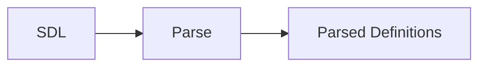

A parsed document is not necessarily a valid schema.

#### 10.2 Schema Assembly

Multiple parsed documents can be combined into one schema.

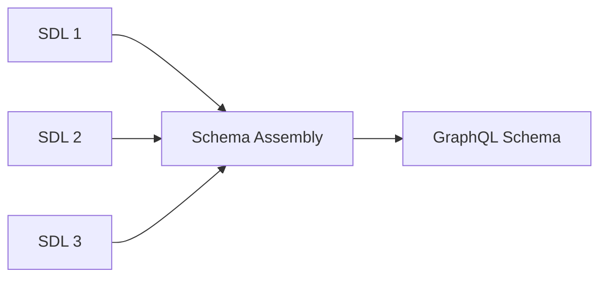

SDL has no file-level visibility model; the assembler determines which definitions belong to the same schema.

#### 10.3 Declaration Order

Definitions are not interpreted as sequential execution statements. References can point to definitions that appear later in the same schema document or in another assembled document.

```graphql
type Post {
  author: User
}

type User {
  id: ID!
}
```

This is valid.

#### 10.4 Cross-Document Assembly

Definitions in different SDL documents can contribute to the same schema:

```graphql
# user.graphql
type User {
  id: ID!
}
```

```graphql
# profile.graphql
extend type User {
  avatar: String
}
```

If both documents are assembled into one schema, `User` contains both fields.

#### 10.5 Schema Validation

Schema validation checks the assembled schema against GraphQL's type-system rules.

Examples include:

* A referenced type must exist.
* A field name must be unique within its type.
* An object implementing an interface must satisfy its fields.
* A union member must be an object type.
* Input positions must use input types.
* Extensions must be compatible with the type they extend.
* Directives must be used at allowed locations.
* Required input cycles are invalid.

### 11. GraphQL Schema Model

#### 11.1 SDL → Schema Model

SDL is a standardized representation of the GraphQL Schema Model.

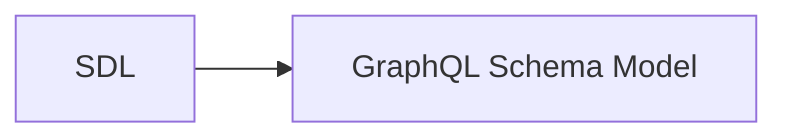

#### 11.2 Alternative Schema Construction

SDL is not required as the mechanism for constructing a schema. An implementation may construct the same model programmatically or through another mechanism.

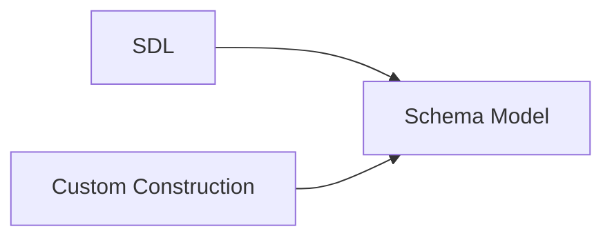

#### 11.3 Schema Model → Implementation

The implementation turns the schema model into whatever internal representation is needed for validation, execution, introspection, and other server functionality.

The internal representation is not standardized.

#### 11.4 Portable vs. Implementation-Specific

| Portable               | Implementation-specific        |
| ---------------------- | ------------------------------ |
| GraphQL Schema Model   | Internal schema representation |
| SDL representation     | Schema construction API        |
| GQL against the schema | Resolver implementation        |
| Schema semantics       | Server architecture            |

**Core idea:** SDL defines the GraphQL schema; the implementation decides how that schema is constructed and represented.

Yes. There was substantial repetition in the draft, particularly around schema-defined validity, fragments, and variables. I also had several sections that restated distinctions already established rather than adding reference value.

The biggest reductions are:

* Remove repeated explanations of fields being schema-defined.
* Collapse basic selection-set material.
* Treat literal values as a compact syntax reference rather than re-explaining their typing.
* Combine variable rules instead of separately restating compatibility/default behavior.
* Reduce fragment sections to the distinctions that matter: named vs. inline, type conditions, composition/cycles.
* Remove the final "GraphQL and the Schema" section because it largely repeats Chapter 2.
* Remove the final mental-model section's repetition of the chapter; retain only a compact summary.

The resulting chapter should be closer to this:

## Chapter 3 — GraphQL Query Language

### 1. Documents and Operations

#### 1.1 Documents

A GraphQL document contains operation definitions and fragment definitions.

#### 1.2 Operations

An operation is an executable unit:

```graphql
query { ... }
mutation { ... }
subscription { ... }
```

The operation type determines its execution semantics.

#### 1.3 Named and Anonymous Operations

Operations may be named:

```graphql
query GetUser {
  user(id: "123") {
    name
  }
}
```

or anonymous:

```graphql
{
  user(id: "123") {
    name
  }
}
```

An anonymous operation is allowed only when the document contains one operation.

A document containing multiple operations requires the request to identify the operation by name.

### 2. Selection Sets

#### 2.1 Fields and Nested Selections

A selection set contains fields, with nested selection sets for object-valued fields:

```graphql
query {
  post(id: "123") {
    title
    author {
      name
    }
  }
}
```

The available selections are determined by the schema type at each level.

#### 2.2 Arguments

Fields may provide arguments:

```graphql
posts(topicId: "42", limit: 20) {
  title
}
```

Arguments supply values to arguments declared by the schema.

### 3. Values and Variables

#### 3.1 Value Literals

GraphQL supports these literal value forms:

| Value        | Example             |
| ------------ | ------------------- |
| Int          | `20`                |
| Float        | `3.14`              |
| String       | `"text"`            |
| Boolean      | `true`              |
| Null         | `null`              |
| Enum         | `NEWEST`            |
| List         | `["a", "b"]`        |
| Input object | `{ topicId: "42" }` |

The expected schema type determines whether a literal is valid.

#### 3.2 Variables

Variables provide values separately from the document:

```graphql
query GetPosts($limit: Int!) {
  posts(limit: $limit) {
    id
  }
}
```

Variables are declared on the operation and supplied by the request.

#### 3.3 Variable Defaults

Variables may have defaults:

```graphql
query GetPosts($limit: Int! = 20) {
  posts(limit: $limit) {
    id
  }
}
```

The default is used when the variable is not provided.

#### 3.4 Variable Type Compatibility

A variable can only be used where its declared type is compatible with the argument's type. This is validated before execution.

### 4. Aliases and Field Merging

#### 4.1 Aliases

An alias changes a field's response name without changing the field selected:

```graphql
{
  displayName: name
}
```

#### 4.2 Field Merging

Selections with the same response name are merged when their field and arguments are compatible:

```graphql
{
  posts(sort: NEWEST) {
    id
  }

  posts(sort: NEWEST) {
    title
  }
}
```

Conceptually:

```graphql
{
  posts(sort: NEWEST) {
    id
    title
  }
}
```

Argument order does not matter.

#### 4.3 Field Conflicts

Selections with the same response name but incompatible fields or arguments produce a validation error.

Aliases can give them different response names.

### 5. Fragments

#### 5.1 Named Fragments

A named fragment defines a reusable selection set:

```graphql
fragment UserFields on User {
  id
  name
}
```

It is included with a fragment spread:

```graphql
user(id: "123") {
  ...UserFields
}
```

#### 5.2 Inline Fragments

An inline fragment provides type-specific selections without defining a reusable fragment:

```graphql
search {
  ... on Post {
    title
  }
}
```

#### 5.3 Type Conditions

`on Type` is a type condition. The fragment's selections apply when the current value is compatible with that type.

Object, interface, and union types can be used as type conditions.

#### 5.4 Fragment Composition

Fragments can spread other fragments. Fragment spreads must be type-compatible with their location and must not form cycles.

### 6. Directives

#### 6.1 Directive Applications

Directives are applied with `@` and may take arguments:

```graphql
name @include(if: $showName)
```

The directive definition determines where it may be used and what arguments it accepts.

#### 6.2 Built-in Execution Directives

`@skip` omits a selection when `if` is true.

`@include` includes a selection only when `if` is true.

Both can apply to fields, fragment spreads, and inline fragments.

#### 6.3 Type Selection vs. Runtime Conditions

| Mechanism            | Based on             |
| -------------------- | -------------------- |
| Inline fragment      | Current GraphQL type |
| `@include` / `@skip` | Runtime Boolean      |

An inline fragment is type-directed selection, not general conditional control flow.

### 7. Syntax Details

#### 7.1 Names and Keywords

GraphQL names begin with `_` or an ASCII letter and may then contain `_`, letters, and digits.

`query`, `mutation`, and `subscription` are operation-type keywords.

#### 7.2 Whitespace, Commas, and Comments

Whitespace and line breaks do not determine structure. Commas are optional and insignificant. Comments begin with `#` and run to the end of the line.

### 8. GQL and the Schema

#### 8.1 Schema-Defined Validity

The schema determines which fields, arguments, and types are valid in a GraphQL document.

#### 8.2 Parsing vs. Validation

Parsing checks GraphQL syntax. Validation checks whether the parsed document is valid against the schema.

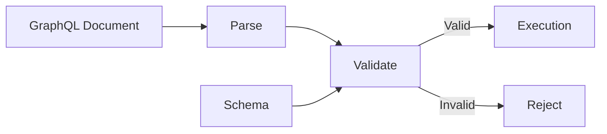

### 9. Chapter Summary

GraphQL query language is a declarative language for selecting data from a schema.

| Construct      | Purpose                               |
| -------------- | ------------------------------------- |
| Operation      | Defines an executable operation       |
| Selection set  | Selects fields                        |
| Argument       | Supplies a field input                |
| Variable       | Supplies runtime input                |
| Alias          | Changes a response name               |
| Fragment       | Reuses selections                     |
| Type condition | Restricts fragment selections by type |
| Directive      | Modifies an executable construct      |

The document describes **what is requested**; execution determines **what that request does**.

## Chapter 4 — GraphQL Execution

Chapter scope: follow an operation from server input through field execution to client delivery. A **transport adapter** is the server framework or application code that connects network requests and responses to the engine's in-process API. Sections 1–8 establish execution behavior; Section 9 connects those mechanisms into a complete server/client exchange, including failures and cancellation.

### 1. Preparing Runtime Variables

Execution first selects one operation from the validated document, using the request's operation name when supplied. An unknown name, or an omitted name when several operations exist, produces a request error before variable coercion or field execution. Only the selected operation executes. [Operation selection](https://spec.graphql.org/September2025/#sec-Executing-Requests)

#### 1.1 Coercing Runtime Variable Values

Before executing any fields, the engine coerces supplied variable values according to their declared input types. A failure prevents the operation from executing, even when the document is valid.

GraphQL's **input coercion** includes acceptance and rejection as well as conversion. The specification organizes the rules by input type, with a separate algorithm for processing variable declarations.

| Input type | Accepted non-null runtime values |
| --- | --- |
| `Int` | Integers from −2³¹ through 2³¹ − 1 |
| `Float` | Finite numbers representable as double-precision values, including integers |
| `String` | Strings only |
| `Boolean` | Booleans only |
| `ID` | Strings or integers, interpreted according to the service's ID format |

Built-in input coercion does not generally parse numeric strings, apply truthiness, or stringify arbitrary values. For example, `"2"` is invalid for `Int`, while `2` is valid. [GraphQL.js scalar implementations](https://github.com/graphql/graphql-js/blob/16.x.x/src/type/scalars.ts)

For other input types:

* **Lists:** coerce each item. A non-list, non-null value is treated as one item: `2` becomes `[2]` for `[Int]`, or `[[2]]` for `[[Int]]`. Empty lists are valid even for `[Int!]!`; item nullability is checked separately.
* **Input objects:** check supplied fields against their declared types recursively. Unknown fields are rejected. Nested defaults do not, by themselves, create an omitted or null parent object.
* **Enums:** require an exact, case-sensitive member name. JSON variables use strings; GraphQL literals use unquoted enum names. Formats with distinct symbolic values can represent enum names that way.
* **OneOf input objects:** an input type marked `@oneOf` requires exactly one supplied field with a non-null, valid value. Other fields must be absent, not explicitly null. [Recursive input coercion implementation](https://github.com/graphql/graphql-js/blob/16.x.x/src/utilities/coerceInputValue.ts)
* **Custom scalars:** follow their own input contract; the scalar's name alone does not specify accepted values. [Custom scalar contracts](https://www.graphql-js.org/docs/custom-scalars/)

**Representation boundary.** Core GraphQL does not require JSON or a canonical intermediate representation. An engine can use native values, but must preserve distinctions needed by the coercion rules, such as strings versus numbers and absent versus null. Decoding cannot arbitrarily turn a JSON string into a number to bypass those rules. Formats without separate integer and float representations, such as JSON, treat a number with no fractional part as an integer: JSON `5.0` can satisfy `Int`; the GraphQL literal `5.0` cannot. [Specification: scalar input coercion](https://spec.graphql.org/September2025/#sec-Scalars.Input-Coercion)

**Validation boundary.** Input object literals in the document are checked recursively during document validation: field names, uniqueness, required fields, and value types. Runtime variable values are checked during variable coercion. Validation also checks variable type compatibility: a variable declared as `Int` cannot be used where `[Int]` is expected, despite singleton coercion for values supplied to a variable declared as `[Int]`.

#### 1.2 Omitted Variables, Explicit Null, and Defaults

| Supplied variable value | Result |
| --- | --- |
| Omitted, with a variable default | Use the default |
| Omitted, without a default | Remain absent if nullable; otherwise fail |
| Explicit `null` | Accept if nullable; otherwise fail |
| Other value | Apply the declared type's input coercion rules |

Defaults replace absence, not null or invalid values. A non-null variable with a default can therefore be omitted, but cannot be explicitly null.

Input object fields follow the same omission rules using their schema defaults. An absent field stays absent unless defaulted; it does not automatically become null. Extra entries in the top-level variables map are ignored by the variable-coercion algorithm, unlike unknown fields inside input objects. [Variable processing implementation](https://github.com/graphql/graphql-js/blob/16.x.x/src/execution/values.ts)

### 2. Collecting Fields for the Current Object

#### 2.1 Filtering Selections Before Resolution

For the current object, field collection follows applicable fragments and evaluates `@skip` and `@include` using the prepared variables. With both directives present, a selection survives only when `skip` is false and `include` is true.

```graphql
query GetUser($showName: Boolean!) {
  user(id: "7") {
    id
    name @include(if: $showName)
  }
}
```

With `showName: false`, the engine collects `user` first. If it produces an object, collection for that object retains only `id`. The `name` resolver is not called, and `name` is absent from the response rather than null.

Collection repeats as execution reaches nested objects; it is not one pass that resolves the entire document upfront.

**Directive processing.** `@skip` and `@include` have behavior explicitly defined by the field-collection algorithm. There is no universal stage where all directives run. A directive is a structured annotation; its allowed location does not establish when it is processed. For example, `@deprecated` supplies schema metadata, while `@oneOf` constrains input objects.

Declaring a custom directive does not implement its behavior. The engine or other tooling must interpret it at the relevant stage. Returning null from a resolver does not reproduce omission during collection. [GraphQL.js directive behavior](https://www.graphql-js.org/docs/using-directives/)

Collection hooks are framework-specific. For example, GraphQL Ruby provides a directive `include?` hook. Such hooks can support custom filtering, but extension code must still preserve required GraphQL behavior; the existence of a hook does not establish conformance. [GraphQL Ruby runtime hooks](https://graphql-ruby.org/type_definitions/directives#runtime-hooks)

#### 2.2 Grouping Selections by Response Name

Surviving selections are grouped by **response name**: the alias when present, otherwise the field name. Each group is executed once for the current object, combining its child selections.

```graphql
{
  first: user(id: "7") { id }
  first: user(id: "7") { name }
  second: user(id: "7") { name }
}
```

| Response name | Execution |
| --- | --- |
| `first` | Resolve `user(id: "7")` once, then execute the combined `id` and `name` selections |
| `second` | Resolve `user(id: "7")` separately, then execute `name` |

Grouping is local to the current object execution. It is not request-wide caching or deduplication by field arguments. [Specification: field collection](https://spec.graphql.org/September2025/#sec-Field-Collection)

**Why each group is unambiguous.** Document validation has already checked that overlapping selections with the same response name can merge:

* Their field names and argument expressions must match.
* Input object arguments are compared recursively; matching their declared input type is insufficient. `{ id: "7" }` and `{ id: "8" }` can both satisfy an input type while conflicting for merging.
* Argument order and input object field order do not matter; list item order does.
* `$a` and `$b` are different expressions even if their supplied values happen to match.
* Combined child selections must also be free of conflicts recursively.

Thus `first: user(id: "7")` conflicts with either `first: user(id: "8")` or `first: topic(id: "news")`. Different aliases allow separate executions. These conflicts are rejected during validation, before field collection.

Fragments on distinct concrete object types may use different fields or arguments under the same response name because they cannot apply to the same object. Their response shapes must still be compatible, including matching leaf types and list/non-null wrappers. [Field-merging validation implementation](https://github.com/graphql/graphql-js/blob/16.x.x/src/validation/rules/OverlappingFieldsCanBeMergedRule.ts)

### 3. Resolving a Collected Field

The implementation examples use GraphQL.js v16, with GraphQL Tools conventions for resolver maps and schema transformations.

#### 3.1 Resolver Maps: Structure and Vocabulary

A **field resolver** is a function that supplies the value of one field on one schema object type. It can read, fetch, or compute that value. The execution engine calls it when executing a collected selection and uses its result to continue traversal.

An explicitly registered GraphQL.js field resolver receives four positional parameters:

```javascript
resolve(parent, args, context, info)
```

| Parameter | Contents |
| --- | --- |
| `parent` | Current object's internal value; the supplied root value for a root field |
| `args` | Prepared arguments for this field |
| `context` | Application-supplied data shared across the execution |
| `info` | Engine-provided metadata about this field execution |

These parameter names are conventions; their positions define the API. A function can omit parameters it does not use. The following sections explain the values and their lifetimes.

A **resolver map** associates schema type names with their implementations. This object structure is a GraphQL Tools API, not GraphQL syntax or a specification requirement.

For an object type, the basic structure is **type name → field name → field resolver**. A field entry accepts either a function or a **field configuration object**:

```javascript
const shorthand = { Query: { greeting: () => "Hello" } };
const explicit = { Query: { greeting: { resolve: () => "Hello" } } };
```

These register equivalent behavior. The callback key is `resolve`. A subscription field can also provide `subscribe`, which establishes its event stream; `resolve` supplies the field value for each event. Section 8 develops that distinction. These are specific callback roles, not an arbitrary sequence of lifecycle hooks.

Top-level keys identify existing schema types. Capitalizing type names is a naming convention. **Root operation types** are the object types assigned to the query, mutation, and subscription roles. Their default names are `Query`, `Mutation`, and `Subscription`, but those names are not reserved. With `schema { query: ReadRoot }`, the resolver-map key is `ReadRoot`. [Root operation types](https://spec.graphql.org/September2025/#sec-Root-Operation-Types)

The shape beneath a type name depends on its kind:

| Schema type kind | Resolver-map entry |
| --- | --- |
| Object, including a root operation type | Field entries; optional `__isTypeOf` callback to check whether a runtime value belongs to this type |
| Interface or union | `__resolveType` callback to identify the concrete object type of a runtime value |
| Scalar | Scalar implementation, with callbacks such as `serialize`, `parseValue`, and `parseLiteral` |
| Enum | Enum member names mapped to internal application values |

Scalar, enum, and runtime type behavior are developed in Section 4. Input objects have no field resolvers; input coercion processes their values. GraphQL Tools also supports interface field resolvers as an opt-in inheritance feature for implementing object types. [Resolver-map types](https://github.com/ardatan/graphql-tools/blob/master/packages/utils/src/Interfaces.ts)

For object entries, ordinary keys must match schema fields. Keys such as `__isTypeOf` and `__resolveType` configure types and sit directly beneath the type name, not inside a field's configuration. The `__` prefix is reserved by GraphQL for introspection names; GraphQL Tools uses it here to distinguish type configuration from user-defined fields. It does not make every prefixed name a recognized callback. **`__typename` is an implicit GraphQL field, not a resolver-map callback.**

The map need not repeat every schema type or field. Omitted field resolvers use default field resolution, explained in Section 3.5. By default, GraphQL Tools rejects supplied type or field names that do not exist in the schema. [Registration implementation](https://github.com/ardatan/graphql-tools/blob/master/packages/schema/src/addResolversToSchema.ts)

#### 3.2 Registering Resolvers and Starting Execution

Registration happens during schema setup. `makeExecutableSchema` combines SDL declarations and a resolver map into an **executable schema**: a GraphQL.js `GraphQLSchema` with the registered implementation callbacks.

```javascript
import { makeExecutableSchema } from "@graphql-tools/schema";
import { graphql } from "graphql";

const typeDefs = `
  type Query {
    greeting: String!
  }
`;

const resolvers = {
  Query: {
    greeting: () => "Hello",
  },
};

const schema = makeExecutableSchema({ typeDefs, resolvers });
const result = await graphql({ schema, source: "{ welcome: greeting }" });
// result.data: { welcome: "Hello" }
```

`typeDefs` is an application-supplied SDL string, parsed internally by `makeExecutableSchema`; it can also be a pre-parsed SDL document. The engine calls the registered `Query.greeting` resolver. The alias determines the response key, not the implementation selected. `graphql()` receives the executable schema; it does not accept a resolver map. [Executable schema construction](https://the-guild.dev/graphql/tools/docs/generate-schema)

GraphQL.js also supports constructing schema types directly in JavaScript and assigning `resolve` and `subscribe` on field definitions. GraphQL Tools supplies the SDL-plus-map registration API used here.

**Execution entry points.** In GraphQL.js, `graphql()` accepts document text as `source`, parses it, validates it against the schema, and starts execution. The lower-level `execute()` accepts a parsed document as `document`; the caller must arrange document validation beforehand. It still selects the operation and coerces runtime variables. `parse()` alone does not validate a document against a schema. Subscription streams use the separate `subscribe()` entry point introduced in Section 8. [Request pipeline](https://github.com/graphql/graphql-js/blob/16.x.x/src/graphql.ts), [Execution implementation](https://github.com/graphql/graphql-js/blob/16.x.x/src/execution/execute.ts)

Execution options supply `variableValues` for document variables and `operationName` to select an operation when a document contains several. They also supply `rootValue` and `contextValue`, described below. These calls run in process; an HTTP handler or other transport adapter can call them and deliver the result.

To validate without executing:

```javascript
import { parse, validate } from "graphql";

const document = parse("{ greeting }");
const errors = validate(schema, document);
```

`parse()` throws on invalid syntax; `validate()` returns an error array, empty when valid. No field resolvers run. Use `execute()` when these steps are handled separately, for example to reuse a parsed, validated document across requests. Reuse does not skip runtime variable coercion, and cached validation depends on the document, schema, and validation rules remaining applicable.

#### 3.3 Coercing Field Arguments and Applying Argument Defaults

Before a field's resolver runs, the engine prepares its arguments. Literals undergo input coercion; variable references use already-coerced variable values. An omitted argument or absent variable permits the argument's schema default to apply.

For this schema field:

```graphql
posts(limit: Int = 10): [Post]
```

And this operation:

```graphql
query GetPosts($limit: Int = 20) {
  posts(limit: $limit) { id }
}
```

| Variables | Prepared field argument |
| --- | --- |
| `{ "limit": 5 }` | `limit: 5` |
| `{}` | `limit: 20`, from the variable default |
| `{ "limit": null }` | `limit: null`; defaults do not replace null |

Removing the variable default makes `{}` leave `$limit` absent, so the argument receives its schema default, `10`.

In GraphQL.js, prepared arguments reach the resolver as its second parameter, conventionally `args`. Here the resolver reads `args.limit`, regardless of the variable name used by the operation. [Argument coercion implementation](https://github.com/graphql/graphql-js/blob/16.x.x/src/execution/values.ts)

#### 3.4 Root and Parent Values

The resolver's first parameter is the **parent value**: the runtime value representing the object whose field is being resolved.

```graphql
{
  user(id: "7") {
    manager {
      name
    }
  }
}
```

| Resolver | Parent value |
| --- | --- |
| `Query.user` | The server-supplied root value |
| `User.manager` | The value returned by `Query.user` |
| `User.name` | The value returned by `User.manager` |

The engine passes these values between calls. Each resolver receives its immediate parent, not an automatic chain of ancestor objects. Applications can explicitly carry ancestor references when needed.

Parent data may include internal properties the client never selects. For example, `User.manager` can use `parent.managerId` to fetch a manager. The root value starts this chain; it is runtime data, distinct from the schema's `Query` type.

Pass it through the execution option `rootValue`. If omitted, GraphQL.js root field resolvers receive `undefined` as their parent; an explicitly registered resolver can still work without using that parameter.

#### 3.5 Default Field Resolution

When no explicit field resolver is registered, GraphQL.js uses a default resolver. It reads the parent property matching the schema field name. If that property is a function, it calls the function as a method of the parent object.

If `Query.user` returns `{ id: "7", name: "Alice" }`, the default resolver can supply both `User.id` and `User.name`. Selecting `displayName: name` still reads `parent.name`.

Property functions invoked by the default resolver receive `(args, context, info)` and are called with the parent as JavaScript `this`. They do not receive a separate `parent` parameter.

These defaults are library behavior, not a property-lookup algorithm required by GraphQL. Schema and document validation do not guarantee implementation completeness: a missing property can produce `undefined`, which GraphQL.js treats as null during completion. A non-null field then fails. [Default resolution implementation](https://github.com/graphql/graphql-js/blob/16.x.x/src/execution/execute.ts)

#### 3.6 Shared Context and Execution Metadata

**Context** carries application-supplied information shared across an execution, such as the authenticated user and service references. Create it in the code that starts execution, before any resolver runs:

```javascript
const result = await graphql({
  schema,
  source: '{ user(id: "7") { name } }',
  contextValue: { database, currentUser },
});
```

Here `graphql` is imported from the `graphql` package; `schema`, `database`, and `currentUser` are prepared by the application. Server frameworks commonly expose a context-building callback. `rootValue` is a separate execution option, supplying top-level resolvers' parent value. [GraphQL.js execution inputs](https://github.com/graphql/graphql-js/blob/16.x.x/src/graphql.ts)

**Lifetime and ownership.** Building a schema registers functions; executing an operation calls them. The application can reuse one schema and its registered functions across concurrent operations. Registration does not create a separate resolver instance per request.

| Value | Scope |
| --- | --- |
| Schema and registered functions | Reusable across operations |
| `rootValue` and `contextValue` | Supplied by the caller for an execution; GraphQL.js does not clone them |
| Resolver `parent`, `args`, and `info` | Describe the current field invocation |
| Services or caches referenced by context | Have the lifetime of their own instances; placing them in context does not recreate them |

Creating a fresh context for each query or mutation execution is an application pattern. A fresh context may reference a shared database pool and a newly created request cache. State captured by a registered resolver's closure remains shared for as long as that function is reused. Subscription lifetimes are addressed in Section 8.2.

Context APIs and mutability are implementation-specific. GraphQL.js passes the same supplied value without enforcing immutability. Treat its properties as stable: using mutations to communicate between resolvers creates execution-order dependencies. Referenced services may manage their own internal state through their interfaces. Even a thread-safe container does not establish an ordering between resolver calls.

**Execution metadata** includes the schema field name, contributing field AST nodes, declared return type, schema, operation, fragments, and prepared variables. GraphQL.js also exposes the initial `rootValue`; it does not retain a general chain of resolved ancestor objects. This API is implementation-specific. [GraphQLResolveInfo](https://github.com/graphql/graphql-js/blob/16.x.x/src/type/definition.ts)

A **response path** identifies the current result's position inside `data`. It uses aliases and zero-based list indices, without the outer `data` key. For `{ viewer: user(id: "7") { friends { name } } }`, the first friend's name has path `["viewer", "friends", 0, "name"]`. GraphQL.js represents `info.path` as linked segments with `key` and `prev`; following `prev` retrieves path segments, not parent data. [Path representation](https://github.com/graphql/graphql-js/blob/16.x.x/src/jsutils/Path.ts)

`info.returnType` is a schema type class instance. For `[User!]!`, it references a `GraphQLNonNull` whose `.ofType` is a `GraphQLList`, containing another `GraphQLNonNull`, containing the `GraphQLObjectType` for `User`. `String(info.returnType)` produces `"[User!]!"`. It describes the declared requirement, not a type inferred from the resolver's result.

#### 3.7 Synchronous and Asynchronous Resolvers

GraphQL.js resolvers can return a value directly or a Promise for that value. The engine waits for a Promise before completing the field; child resolvers receive the resolved value.

This also works for function-valued properties called by the default resolver:

```javascript
const user = {
  async name() {
    return "Alice";
  },
};
```

A rejected Promise is handled as a field execution error, like a synchronous throw. Synchronous and asynchronous resolvers can coexist in one operation. Their scheduling is covered in Section 6. [Async execution handling](https://github.com/graphql/graphql-js/blob/16.x.x/src/execution/execute.ts)

#### 3.8 Resolver Wrapping as an Application Pattern

A resolver wrapper is an ordinary **higher-order-function pattern**, not a GraphQL concept or required execution stage. It replaces a resolver with a function that adds shared behavior around its call.

For a resolver expected to return a string:

```javascript
const withUppercase = resolve =>
  async (parent, args, context, info) => {
    const value = await resolve(parent, args, context, info);
    return value.toUpperCase();
  };
```

Registering `withUppercase(original)` preserves the original inputs, supports direct values or promises, and propagates failures. This wrapper assumes a string result; it is not a general wrapper for every return type.

With `outer(inner(original))`, calls enter `outer`, then `inner`, then `original`; results pass back through the wrappers in reverse order. Libraries can help attach and compose wrappers, but the engine simply calls the resulting function. A field wrapper cannot intercept work that occurs before its field is invoked, such as field collection. [Resolver composition](https://the-guild.dev/graphql/tools/docs/resolvers-composition)

#### 3.9 Implementing Directive Behavior

**Query directives** can be inspected through the contributing field nodes in `info.fieldNodes`. For a directive declared as:

```graphql
directive @uppercase(enabled: Boolean! = true) on FIELD
```

GraphQL.js can prepare its arguments for a selected field node:

```javascript
import { getDirectiveValues } from "graphql";

const options = getDirectiveValues(
  info.schema.getDirective("uppercase"),
  fieldNode,
  info.variableValues
);
```

Here `fieldNode` is one entry in `info.fieldNodes`. The helper returns `undefined` when the directive is absent, `{ enabled: true }` when its default applies, or its supplied argument values with variables resolved. Application code implements the behavior. Directives on operations or fragments remain on those nodes; they are not copied onto child field nodes. [Query directive handling](https://www.graphql-js.org/docs/using-directives/#implementing-custom-directive-behavior)

**Schema directives** can select resolvers for wrapping during setup. For this separate directive definition:

```graphql
directive @uppercase on FIELD_DEFINITION

type Query {
  greeting: String! @uppercase
}
```

GraphQL Tools can install the preceding wrapper on annotated fields:

```javascript
import { defaultFieldResolver } from "graphql";
import { getDirective, mapSchema, MapperKind } from "@graphql-tools/utils";

const executableSchema = mapSchema(schema, {
  [MapperKind.OBJECT_FIELD]: field => {
    const directive = getDirective(schema, field, "uppercase")?.[0];
    if (!directive) return field;

    return {
      ...field,
      resolve: withUppercase(field.resolve ?? defaultFieldResolver),
    };
  },
});
```

`schema` already contains the application resolvers. `mapSchema` transforms the constructed schema's field configurations, not the SDL syntax tree directly. `getDirective` reads retained directive metadata. The transformation returns a new schema with updated references; the original resolver is called by its replacement wrapper. Execute requests against `executableSchema`.

The annotation is read during setup; uppercasing happens when the field executes. These are library APIs, not an automatic GraphQL directive pipeline. [Schema transformations](https://the-guild.dev/graphql/tools/docs/schema-directives#implementing-schema-directives)

**Grouping and repeatability** impose separate considerations on query directives:

| Applications | Requires `repeatable`? | Resolver metadata |
| --- | --- | --- |
| Twice on one field selection | Yes | One field node with two directive nodes |
| Once on each of two merged selections | No | Two field nodes, each with one directive node |

Non-repeatable means once per document location, not once per resolver invocation. Custom directives may therefore supply conflicting settings across merged selections. Define a policy, such as requiring agreement through custom validation or enabling behavior when any selection requests it. Reading only `info.fieldNodes[0]` implicitly gives the first selection control.

GraphQL.js's `getDirectiveValues` reads the first matching application on a node; it does not aggregate repeatable applications. Handling those requires inspecting all their directive nodes. [Directive argument helper](https://github.com/graphql/graphql-js/blob/16.x.x/src/execution/values.ts)

For built-in `@skip` and `@include`, filtering precedes grouping: skipping one occurrence does not veto a surviving occurrence. Only surviving field nodes and their child selections contribute to execution. Custom resolver-based behavior runs after this filtering. [Field collection](https://spec.graphql.org/September2025/#sec-Field-Collection)

### 4. Completing the Resolved Value

#### 4.1 Resolved Values vs. Response Values

**Value completion** turns a resolver's internal result into the response value required by its declared output type. Scalar and enum values undergo result coercion; objects require child-field execution; lists require item completion. Nullability determines how failures propagate, covered in Section 5.

Validation establishes that the document is valid against the schema. It cannot guarantee that application code will return valid values at execution time.

There is no required canonical intermediate format. An engine uses native values while enforcing GraphQL's result rules, then the response is serialized for transport. Serializing one custom scalar and serializing the entire response are distinct operations.

#### 4.2 Scalar and Enum Result Coercion

**Scalar outputs.** Input and output coercion have different acceptance rules. These GraphQL.js v16 examples show result coercion, not permission for clients to supply the same values as inputs:

| Declared output | Resolver result | Completed value |
| --- | --- | --- |
| `Int` | `"2"` | `2` |
| `String` | `42` | `"42"` |
| `ID` | `7` | `"7"` |
| `Int` | `2.5` | Execution error |
| `Float` | `Infinity` | Execution error |

GraphQL specifies the resulting scalar's constraints; implementations choose supported conversions from internal values within those constraints. [GraphQL.js scalar implementations](https://github.com/graphql/graphql-js/blob/16.x.x/src/type/scalars.ts)

**Custom scalar output.** For `scalar DateTime` and a field `now: DateTime`, an application can return a JavaScript `Date` and serialize it to a string:

```javascript
import { GraphQLScalarType } from "graphql";

const DateTimeScalar = new GraphQLScalarType({
  name: "DateTime",
  serialize(value) {
    if (!(value instanceof Date)) {
      throw new TypeError("Expected a Date");
    }
    return value.toISOString();
  },
});

const resolvers = {
  DateTime: DateTimeScalar,
  Query: { now: () => new Date() },
};
```

This example supplies only the output implementation. Invalid dates also fail because `toISOString()` throws. The client receives a string, not a JavaScript `Date`. A scalar serializer throwing, or returning null for a non-null internal value, produces an execution error. [Custom scalars](https://www.graphql-js.org/docs/custom-scalars/)

**Custom scalar inputs.** GraphQL.js v16 exposes separate callbacks for the two input representations:

| Callback | Receives | Produces |
| --- | --- | --- |
| `serialize` | Internal output value | Response scalar value |
| `parseValue` | Decoded runtime input, such as a variable value | Internal input value |
| `parseLiteral` | GraphQL literal AST node | Internal input value |

An AST node preserves syntax that a decoded value may lose. The literals `5` and `5.0` have different node kinds, but generic decoding produces the number `5` for both.

| Input callbacks supplied | GraphQL.js v16 behavior |
| --- | --- |
| Only `parseValue` | Default `parseLiteral` decodes the AST and delegates to `parseValue` |
| Both | Application controls value and literal handling separately |
| Only `parseLiteral` | Rejected during scalar construction |
| Neither | Default input handling passes decoded values through |

There is no SDL or `GraphQLScalarType` option declaring a primitive backing scalar. Application callbacks can reuse built-in scalar coercion methods, but must define the custom contract. Inspect literal kinds when the contract depends on syntax distinctions that generic decoding loses. [Scalar callback defaults](https://github.com/graphql/graphql-js/blob/16.x.x/src/type/definition.ts)

Literal rejection need not wait for execution: GraphQL.js document validation invokes `parseLiteral`, including its default delegation. Runtime variable values instead reach `parseValue` during variable coercion. SDL or introspection alone does not expose those executable checks. [Literal validation](https://github.com/graphql/graphql-js/blob/16.x.x/src/validation/rules/ValuesOfCorrectTypeRule.ts)

**Enum outputs.** The response uses the schema's enum member name; the application may use a different internal value. For `enum Status { OPEN CLOSED }`, a GraphQL Tools resolver map can define:

```javascript
const resolvers = {
  Status: { OPEN: 0, CLOSED: 1 },
  Query: { status: () => 0 },
};
```

With `status: Status`, the completed result is `"OPEN"`. Returning an unmapped value such as `2` fails. Input coercion performs the reverse mapping from member name to internal value; without a custom mapping, the internal value is the member name. [Enum internal values](https://the-guild.dev/graphql/tools/docs/scalars#internal-values)

GraphQL.js also permits symbols as internal enum values. If `OPEN` maps to a particular `Symbol("OPEN")`, return that same symbol instance; another symbol with the same description is a different value.

#### 4.3 Object Results: Repeating Collection, Resolution, and Completion

An object result becomes the parent for its selected child fields. The engine repeats field collection, resolution, and completion for that object; it does not copy the returned record into the response or structurally check it against every schema field.

For `user: User` and `User.name: String`:

```javascript
const resolvers = {
  Query: {
    user: () => ({ displayName: "Alice", managerId: "8" }),
  },
  User: {
    name: parent => parent.displayName,
  },
};
```

The query `{ user { name } }` produces `{"data":{"user":{"name":"Alice"}}}`. Neither internal property is copied to the response. The schema requirement applies to the completed `name` field, whose value came from application code. If `user` resolves to null, its child fields do not execute.

#### 4.4 Interfaces and Unions: Determining the Object Type Before Recursing

For an interface or union result, the engine must identify a permitted concrete object type before applying fragment conditions and executing its child fields. GraphQL requires that determination; the application and engine decide how to make it.

For example:

```graphql
union SearchResult = User | Topic

type User { name: String }
type Topic { name: String }
type Query { search: SearchResult }
```

With a discriminator already matching the schema type name, the resolver map can be direct:

```javascript
const resolvers = {
  Query: {
    search: () => ({ kind: "User", name: "Alice" }),
  },
  SearchResult: {
    __resolveType: ({ kind }) => kind,
  },
};
```

`__resolveType` is GraphQL Tools' resolver-map name for the GraphQL.js type option `resolveType`. It chooses a type for an existing value; it does not fetch the value or resolve its child fields. Translating a discriminator is needed only when application values differ from schema type names.

**Default type resolver.** If no custom `resolveType` is configured, GraphQL.js's default type resolver first reads a string `__typename` property from the value. Without that property, it tries application-provided `isTypeOf` checks on the possible object types. The engine supplies the fallback procedure; the checks themselves are custom code.

For example, omit `SearchResult.__resolveType` and return `{ __typename: "User", name: "Alice" }`. Alternatively, return `{ kind: "User", name: "Alice" }` and register checks:

```javascript
const resolvers = {
  User: { __isTypeOf: value => value.kind === "User" },
  Topic: { __isTypeOf: value => value.kind === "Topic" },
};
```

`__isTypeOf` is the resolver-map name for `isTypeOf`. Failure to identify an allowed type is an execution error; GraphQL.js does not infer one by comparing the object's properties with schema fields. A custom `resolveType` replaces the fallback: returning null from it does not trigger another attempt through `__typename` or `isTypeOf`. [Abstract type resolution](https://www.graphql-js.org/docs/abstract-types/)

An object type's `isTypeOf` check, when configured, also verifies values during object completion, even when the concrete type was already determined. This is application-defined recognition, not automatic structural validation. [Object completion implementation](https://github.com/graphql/graphql-js/blob/16.x.x/src/execution/execute.ts)

**Returning the type name to the client.** Two uses of `__typename` must be distinguished:

| Use | Authority |
| --- | --- |
| Select `__typename` in a query to receive the concrete type name | GraphQL specification |
| Put `__typename` on a returned JavaScript object for default type resolution | GraphQL.js convention |

The query meta-field `__typename: String!` is implicit on objects, interfaces, and unions. It is valid without an SDL declaration and returns the type the engine determined, including when a custom callback identified it. It cannot be selected at a subscription root. [Type name introspection](https://spec.graphql.org/September2025/#sec-Type-Name-Introspection)

```graphql
{
  search {
    __typename
    ... on User { name }
    ... on Topic { name }
  }
}
```

The example produces `{"data":{"search":{"__typename":"User","name":"Alice"}}}`. Without selecting `__typename`, only `name` appears, and the client cannot distinguish otherwise identical results from the two types. Internal type identification does not automatically add the field to the response.

#### 4.5 Lists: Completing Each Item by Its Declared Type

For a list, complete each item according to the declared item type. `[Int]` applies integer result coercion to each item; `[SearchResult]` determines each item's concrete type separately; nested lists repeat list completion.

For `{ users { name } }` with `users: [User]`, a resolver returning `[{ displayName: "Alice" }, { displayName: "Bob" }]` causes Section 4.3's `User.name` resolver to run once for each object. Each receives its own list item as parent, producing `[{ "name": "Alice" }, { "name": "Bob" }]` within `data.users`.

Item order is preserved even when asynchronous work finishes out of order. Output coercion does not wrap single values into lists: returning one user object for `[User]` fails; return `[user]`. List and item nullability are separate, covered in Section 5.4.

### 5. Nullability and Errors

#### 5.1 Request Errors vs. Execution Errors

For query and mutation execution, and for each subscription event's execution:

| Category | Examples | Response |
| --- | --- | --- |
| Request error | Invalid syntax, unknown selected field, invalid runtime variable | `errors`, with no `data` key; execution does not begin |
| Execution error | Resolver throws or rejects; result coercion fails | `data` and `errors`; successful data may survive |

An absent `data` key is distinct from an execution result whose `data` is null. Subscription source-stream setup has separate failure handling, covered in Section 8.3. [GraphQL.js errors](https://www.graphql-js.org/docs/graphql-errors/)

#### 5.2 Resolver Outcomes: Values, Nulls, and Errors

| Resolver outcome | Nullable field | Non-null field |
| --- | --- | --- |
| Returns null | Null without an error | Engine records an error and propagates null |
| Throws or rejects | Null with an error | Error is recorded and null propagates |

Returning null for a missing user can therefore produce `{"data":{"user":null}}` with no error. A failed database lookup can produce the same data plus an error entry. Successful executions omit `errors`; they do not return an empty error list.

An expected application outcome can also be ordinary schema data:

```graphql
union UserLookupResult = User | UserNotFound

type UserNotFound {
  message: String!
}
```

A field returning this union can resolve to `UserNotFound` and complete its selected fields successfully. There is no GraphQL execution error merely because the application calls the outcome a failure. Nullable data is sufficient when absence alone expresses the outcome; an explicit result type can carry additional distinctions or details.

**Using partial data.** The application decides whether surviving fields suffice for its action. A profile can remain useful when recommendations fail; a calculation requiring a failed input cannot proceed. A failed null must not silently become a claim that no data exists.

Client handling varies. Apollo Client 4 discards partial response data by default; `errorPolicy: "all"` exposes data and errors separately, leaving field association through error paths to application code. Relay's client-specific `@catch` can expose a selected field as a success/error result, distinguishing an ordinary null from a failure. That wrapper is a client representation, not the GraphQL wire format. Rejecting partial results is also a valid application policy. [Apollo error policies](https://www.apollographql.com/docs/react/data/error-handling), [Relay field errors](https://relay.dev/docs/guides/catch-directive/)

#### 5.3 Error Entries and Response Paths

The GraphQL specification defines these error entries:

| Key | Requirement |
| --- | --- |
| `message` | **Must** appear on every error as a string; wording is not prescribed |
| `path` | **Must** appear when the error is associated with a field in the result |
| `locations` | **Should** appear when the error can be tied to document text; entries contain one-based `line` and `column` |

`locations` is recommended, not guaranteed. Syntax, validation, and variable coercion errors have no execution response position and therefore no response path. Every field execution error has one. [Error format](https://spec.graphql.org/September2025/#sec-Errors)

As with the execution metadata in Section 3.6, a path uses response names, including aliases, and zero-based list indices. `["users", 2, "age"]` identifies `data.users[2].age`. Locations point into the document; paths point to positions in the result. The following response examples omit document locations for brevity.

#### 5.4 Non-Null Propagation Through Lists and Objects to the Root

On an execution error, the affected position becomes null. If that position is non-null, null propagates outward until it reaches the first nullable position. The error is recorded once at its original path, even when propagation removes that path from the returned data.

For this schema:

```graphql
type Query { user: User }
type User {
  name: String!
  age: Int!
}
```

If `{ user { name age } }` resolves `name` successfully but `age` throws:

```json
{
  "data": { "user": null },
  "errors": [
    { "message": "Age lookup failed", "path": ["user", "age"] }
  ]
}
```

`age` cannot be null, so the containing user becomes null and its successful `name` is lost from the response. If `user` were also non-null (`User!`), the result would instead contain `"data": null` with the same error path. The top-level `data` value can always be null, regardless of schema non-null declarations. [Null propagation](https://www.graphql-js.org/docs/nullability/)

**List boundaries.** Suppose a `scores` resolver returns `[10, "oops", 30]`. The second item fails integer result coercion:

| Declared field type | Result |
| --- | --- |
| `[Int]` | `[10, null, 30]` |
| `[Int]!` | `[10, null, 30]` |
| `[Int!]` | The whole list becomes null |
| `[Int!]!` | Null propagates to the field's parent and continues outward |

The error path is `["scores", 1]` in every case. The inner `!` governs items; the outer `!` governs the list. These rules compose with objects: for `users: [User!]` and `User.age: Int!`, one failing age makes its user invalid and therefore the whole list null. The path still identifies the original age, such as `["users", 1, "age"]`.

### 6. Query Execution and Data Fetching

#### 6.1 Dependencies and Scheduling

Query execution follows parent-value dependencies, not a guaranteed order between independent fields:

```graphql
{
  user {
    name
    manager { name }
  }
  serverVersion
}
```

`user.name` and `user.manager` need the value returned by `Query.user`. The manager's name needs the value returned by `User.manager`. `serverVersion` is independent of the user branch.

Independent fields may overlap, but parallel execution is not required. The engine need not finish one depth of the query before beginning another. Query fields must be side-effect-free and idempotent, so correctness cannot depend on a sibling running first. Setting a context property in one sibling for another to read violates that independence. [Execution scheduling](https://spec.graphql.org/September2025/#sec-Normal-and-Serial-Execution)

Response fields retain the order established by field collection: the first surviving occurrence of each response name determines its position, with fragments expanded where they appear. For `{ user { name age name } }`, the merged `name` precedes `age` in the response even if `age` finishes first. Response order does not establish resolver execution order.

#### 6.2 Repeated Fetches, Batching, and Request Caches

One GraphQL request can cause many backend requests. For `{ users { name manager { name } } }`, consider:

```javascript
const resolvers = {
  Query: { users: () => database.getUsers() },
  User: { manager: user => database.getUserById(user.managerId) },
};
```

If each database helper makes one request and `users` returns 100 items, execution makes 101 requests: one for the list and one per manager. This is the **N+1 problem**, even if many users share a manager. Field grouping does not combine separate list-item positions or deduplicate backend calls.

**Batching** combines lookups for multiple keys into one backend request. **Caching** reuses an earlier lookup for the same key. These are general optimization patterns, not GraphQL requirements; frameworks or application libraries can supply them. GraphQL.js does not automatically coordinate backend access. [N+1 and DataLoader](https://www.graphql-js.org/docs/n1-dataloader/)

**DataLoader** is a generic batching and memoization utility with no dependency on GraphQL. Each resolver can request one value while the loader groups pending lookups. The application still supplies the batch-fetching function:

```javascript
import DataLoader from "dataloader";

function createContext() {
  return {
    userLoader: new DataLoader(async ids => {
      const users = await database.getUsersByIds(ids);
      const byId = new Map(users.map(user => [user.id, user]));
      return ids.map(id => byId.get(id) ?? null);
    }),
  };
}

const resolvers = {
  User: {
    manager: (user, args, context) =>
      context.userLoader.load(user.managerId),
  },
};
```

`getUsersByIds` is an application helper that fetches several users in one backend request. DataLoader requires one result per key in the same order; the mapping preserves that order and represents missing users as null. Each `.load()` returns a promise for its own result. [DataLoader batch contract](https://github.com/graphql/dataloader#batch-function)

Pass a fresh `createContext()` result as `contextValue` for each request. This scopes the loader and its cache to that request; the library does not reset a shared instance automatically. This is a usage convention, not a GraphQL rule. The engine simply awaits the resolver's promise and completes its value normally.

### 7. Mutation Execution

#### 7.1 Side Effects in Top-Level Mutation Fields

A top-level mutation field uses an ordinary resolver but may perform side effects, such as updating stored data:

```graphql
type Mutation {
  renameUser(id: ID!, name: String!): User
}
```

```javascript
const resolvers = {
  Mutation: {
    renameUser: (parent, { id, name }, context) =>
      context.database.renameUser(id, name),
  },
};
```

Here the application helper performs the update and returns the updated user. For `mutation { renameUser(id: "7", name: "Alice") { name } }`, the engine awaits that result and completes the selected `User.name` field normally.

The permission to perform side effects applies only to top-level mutation fields. Their nested fields remain side-effect-free: selecting `User.name` must not trigger another update. Application code upholds this by convention; GraphQL.js enforces execution ordering, not resolver purity. Nested selections can reuse the same object types and field resolvers used by queries. [Mutation field behavior](https://spec.graphql.org/September2025/#sec-Normal-and-Serial-Execution)

#### 7.2 Serial Top-Level Fields and Nested Completion

Top-level mutation fields execute serially in collection order. Each field completes, including its selected nested fields, before the next top-level field begins:

```graphql
mutation {
  first: renameUser(id: "7", name: "Alice") { name }
  second: renameUser(id: "7", name: "Bob") { name }
}
```

The first result is completed while the name is Alice, before the second update changes it to Bob. Nested fields use normal execution scheduling; serial execution applies to the mutation root, not every field beneath it. Separate mutation requests are not serialized by this rule. [Serial execution implementation](https://github.com/graphql/graphql-js/blob/16.x.x/src/execution/execute.ts)

#### 7.3 Failures and Transaction Boundaries

| Root mutation field failure | Effect |
| --- | --- |
| Nullable field | That field becomes null; later root fields execute |
| Non-null field | Null propagates to `data`; later root fields do not execute |

If the first update succeeds and the second fails through a non-null root field, the response has `data: null`: the first field's completed result is lost, but its side effects are not rolled back. A write can also succeed before its own selected output fails during completion.

Serial execution is not a transaction. Use application workflow or transaction logic for dependent writes; non-null propagation is an output contract, not a reliable indication that a write did or did not commit. An application failure represented as ordinary schema data does not stop later mutation fields.

### 8. Subscription Execution

A subscription submits one operation to receive a sequence of results as application events occur. For `subscription { userUpdated { name } }`, one result might contain the name `"Alice"` and a later result `"Bob"`. Each event produces its own execution result, not a patch to the previous result.

| Component | Responsibility |
| --- | --- |
| Application event source | Defines which events occur, when they occur, and their payloads |
| GraphQL engine | Executes the selected fields for each event to produce a result |
| Transport adapter | Delivers the result sequence to the client |

Declaring a subscription does not make GraphQL watch a database. The application connects an event source; sending an initial snapshot is also an application choice.

#### 8.1 Event Streams and Establishing the Source Stream

A subscription operation must collect exactly one root field, including selections reached through fragments. Its schema root type can declare many fields, but requesting separate root streams requires separate operations. Introspection fields and `@skip`/`@include` are forbidden at the subscription root. [Subscription validation](https://spec.graphql.org/September2025/#sec-Single-Root-Field)

A **source event stream** is the sequence of application payloads that will drive subscription execution. GraphQL.js represents it as an **async iterable**: a JavaScript value whose items can be consumed over time with `for await...of`. It is not a Promise for one final result or a particular network protocol.

For a subscription root field declared as `userUpdated: User`, register a stream-producing callback:

```javascript
const resolvers = {
  Subscription: {
    userUpdated: {
      subscribe: (parent, args, context) => context.events.userUpdates(),
    },
  },
};
```

Here `events` is an application service and `userUpdates()` returns an async iterable. Supplying that service through context is a dependency-injection pattern. The callback can instead construct a stream directly from its arguments. The schema's `User` return type describes each event's completed field value, not the stream container.

After registering this map in the schema, the server starts subscription processing with GraphQL.js's exported function:

```javascript
import { subscribe } from "graphql";

const resultOrStream = await subscribe({ schema, document, contextValue });
```

Here `document` is the parsed subscription document, already validated against `schema`, and `contextValue` supplies the event service. Like `execute()`, this API does not perform document validation. Successful setup returns a result stream; Section 8.3 distinguishes error results from rejected calls.

The exported **`subscribe()` function** starts engine processing. The registered **field `subscribe` callback** supplies the source stream and is called once during successful setup. They share a name but occupy different API layers. Section 8.2 explains how source events become response results. [GraphQL.js subscription implementation](https://github.com/graphql/graphql-js/blob/16.x.x/src/execution/subscribe.ts)

#### 8.2 Event Values as Roots for Repeated Execution

Each source event becomes the root value for executing the subscription's selection set. For an application event shaped as `{ user: { name: "Alice" } }`, add a per-event resolver:

```javascript
const resolvers = {
  Subscription: {
    userUpdated: {
      subscribe: (parent, args, context) => context.events.userUpdates(),
      resolve: event => event.user,
    },
  },
};
```

For `subscription { userUpdated { name } }`, `resolve` receives the event, returns its user, and `User.name` receives that user as parent. Normal field resolution, value completion, and error handling produce `{"data":{"userUpdated":{"name":"Alice"}}}`. These resolvers can be asynchronous. The stream-producing callback is not called again for each event.

If events instead contain `{ userUpdated: { name: "Alice" } }`, default field resolution can read `event.userUpdated`, so the explicit per-event resolver can be omitted. Event payload shape is an application choice.

**Consumption and concurrency.** In GraphQL.js v16, each result iterator `.next()` independently obtains a source event and awaits its GraphQL execution. The wrapper has no queue waiting for the previous event's execution. Concurrent calls can therefore overlap executions; a consumer using `for await...of` requests them sequentially. A source async generator's own queue governs event production, not the downstream GraphQL execution. [Iterator mapping](https://github.com/graphql/graphql-js/blob/16.x.x/src/execution/mapAsyncIterator.ts)

**Subscription lifetimes.** GraphQL.js's `subscribe()` reuses the supplied schema, operation, and context for event executions, replacing `rootValue` with each event payload. Context is not automatically recreated per event. A cache stored there can therefore last for the entire subscription; per-event isolation or refreshing must be arranged by application or framework code. A transport connection, a subscription, and an event execution are distinct scopes. [Event execution inputs](https://github.com/graphql/graphql-js/blob/16.x.x/src/execution/subscribe.ts)

#### 8.3 Event Execution Errors, Stream Failure, and Cancellation

| Failure in GraphQL.js v16 | In-process outcome |
| --- | --- |
| Field `subscribe` callback throws or rejects | Exported `subscribe()` returns an error result instead of a stream |
| Field resolution or completion fails for an event | That event's result contains errors and follows null propagation; the subscription does not automatically terminate |
| Source iterator's `.next()` rejects | Result iterator's corresponding `.next()` rejects; no field-error result is generated |

A setup callback failure can produce an error with a field `path` but no `data` key. That differs from document validation errors, which have no field execution path. Invalid API inputs or returning a non-iterable as the source can instead reject the exported `subscribe()` call. [Subscription error handling](https://github.com/graphql/graphql-js/blob/16.x.x/src/execution/subscribe.ts)

An uncaught throw inside an async generator rejects its `.next()` Promise. Yielding an `Error` object is different: it supplies an event value. Normal stream completion returns `done: true`.

Calling the result iterator's `.return()` forwards cancellation to the source's `.return()` when present. The source owns resource cleanup; this does not automatically cancel resolver I/O already in progress. Section 9.5 follows these outcomes across the network boundary.

### 9. Connecting Execution to the Client

#### 9.1 Receiving a Request and Invoking the Engine

**GraphQL over HTTP** is a protocol specification, currently a draft, not a library. It defines request parameters, HTTP methods, media types, and response behavior. Server frameworks or application handlers implement the adapter between that protocol and the engine API.

For example:

```http
POST /graphql HTTP/1.1
Content-Type: application/json
Accept: application/graphql-response+json

{"query":"query GetUser($id: ID!) { user(id: $id) { name } }","operationName":"GetUser","variables":{"id":"7"}}
```

After decoding and checking the request parameters, the adapter maps them to GraphQL.js:

```javascript
import { graphql } from "graphql";

const result = await graphql({
  schema,
  source: body.query,
  operationName: body.operationName,
  variableValues: body.variables,
  contextValue: { database, currentUser },
});
```

`body` is the decoded request. The server supplies its prepared executable `schema`, application service `database`, and authenticated identity `currentUser`. The transport first parses JSON; the engine then parses the GraphQL text inside `query`. The parameter is named `query` even when it contains a mutation. [HTTP request format](https://http-spec.graphql.org/draft/#sec-Request)

POST support is required by the HTTP draft; GET support is optional and cannot execute mutations. GET places the parameters in the URL query string. `variables` and `extensions` are JSON-serialized and then URL-encoded; the GraphQL document string is URL-encoded directly.

| Header | JSON protocol use |
| --- | --- |
| POST request `Content-Type` | `application/json`; servers must support UTF-8 JSON requests |
| Client `Accept` | Includes `application/graphql-response+json`; can also advertise legacy `application/json` responses |
| Response `Content-Type` | Identifies the format selected by the server |

Additional serialization formats are permitted, while parameter names and semantics remain the same. The GraphQL document remains a string and variables remain a map. GET's prescribed URL encoding is separate from POST body encoding. [Serialization rules](https://http-spec.graphql.org/draft/#sec-Serialization-Format)

#### 9.2 Authorization and Execution Limits

Authentication establishes the identity supplied in context; application authorization decides which actions or data it permits. GraphQL's standard validation rules do not establish permission.

The same field can be reached through different paths:

```graphql
{
  user(id: "7") { email }
  project(id: "42") { owner { email } }
}
```

A check in `Query.user` alone does not protect the second path. One application pattern is to call a service that enforces the policy from `User.email`:

```javascript
const resolvers = {
  User: {
    email: (user, args, context) =>
      context.users.readEmail(context.currentUser, user.id),
  },
};
```

Both paths use that resolver. The service's permission policy also applies to callers outside GraphQL. If it throws, normal field-error handling and null propagation apply; permission denial does not inherently terminate the entire operation. [Authorization strategies](https://www.graphql-js.org/docs/authorization-strategies/)

**Work limits.** Validity and batching do not bound total work. Selecting 100 users and 100 posts per user can require processing 10,000 posts even when database calls are batched.

| Control | Enforcement point |
| --- | --- |
| Request-body size | Transport handling, before GraphQL parsing |
| Document depth or estimated cost | Document analysis before field execution |
| Maximum page/list size | Argument policy and data-fetching implementation |
| Execution deadline | Runtime coordination with resolvers and downstream services |

GraphQL.js v16 does not automatically impose application depth, cost, or execution-time limits. Additional validation rules or analysis can estimate work; depth alone does not capture list expansion or field cost. Deadline enforcement and cancellation of active I/O require server and service support. [Operation complexity controls](https://www.graphql-js.org/docs/operation-complexity-controls/)

#### 9.3 Returning a Query or Mutation Result

The adapter serializes the engine's result and writes the HTTP response:

```http
HTTP/1.1 200 OK
Content-Type: application/graphql-response+json; charset=utf-8

{"data":{"user":{"name":"Alice"}}}
```

The client decodes the response into its own local value. A client can be ordinary `fetch()` code that understands the protocol; a dedicated GraphQL client library is not required.

| Outcome | HTTP draft's response model |
| --- | --- |
| Execution succeeds without errors | `200` with a GraphQL data result |
| Field errors with surviving data | A `2xx` response containing both `data` and `errors` |
| Request cannot execute, or server cannot handle it | Appropriate `4xx` or `5xx` |

A successful HTTP status does not establish error-free GraphQL data. A non-success status can still carry a GraphQL error result: `application/graphql-response+json` identifies that representation, whereas an intermediary's error response might have a different body format. [Response semantics](https://http-spec.graphql.org/draft/#sec-Response)

Exact status policies vary with protocol revision and implementation. The draft inspected on 2026-09-10 recommends `294` when a result contains both `data` and `errors`, including `data: null`; the inspected `graphql-http` implementation returns `200` for execution results. Neither policy changes GraphQL null propagation or the result's `errors` entries. [Draft status rules](https://http-spec.graphql.org/draft/#sec-Status-Codes), [Adapter status mapping](https://github.com/graphql/graphql-http/blob/master/src/handler.ts)

Unexpected exceptions outside GraphQL's result handling reach the server integration's error handler, which chooses a public response. Exception objects and stack traces are not automatically sent over HTTP.

#### 9.4 Streaming Subscription Results over HTTP

**GraphQL over Server-Sent Events (SSE)** is one subscription delivery protocol, implemented by `graphql-sse`. Its *distinct connections mode* associates one operation with each HTTP response stream. It extends the HTTP example by requesting a streaming response:

```http
POST /graphql HTTP/1.1
Content-Type: application/json
Accept: text/event-stream

{"query":"subscription { userUpdated { name } }"}
```

The adapter consumes GraphQL.js's result iterator and writes each result as JSON inside an SSE event:

```http
HTTP/1.1 200 OK
Content-Type: text/event-stream

event: next
data: {"data":{"userUpdated":{"name":"Alice"}}}

event: next
data: {"data":{"userUpdated":{"name":"Bob"}}}

event: complete
data:

```

Blank lines delimit events. `complete` signals normal completion; an open subscription keeps the response streaming. The client parses the SSE framing and decodes each GraphQL result. The server's async iterator remains server-side. [SSE protocol](https://github.com/enisdenjo/graphql-sse/blob/master/PROTOCOL.md)

Core GraphQL defines response-stream semantics, not universal wire messages named `subscribe`, `next`, and `complete`. The protocols choose their representations:

| Action | SSE distinct mode | `graphql-transport-ws` over WebSocket |
| --- | --- | --- |
| Start operation | HTTP request | `subscribe` message |
| Deliver result | `next` SSE event | `next` message |
| Normal completion | `complete` SSE event | `complete` message |
| Cancel from client | Cancel HTTP response stream | `complete` message |

The WebSocket protocol uses operation IDs to multiplex operations on one connection. SSE's distinct mode needs no operation ID because the response stream identifies the operation; its single connection mode adds multiplexing. An HTTP response stream is not necessarily a separate network connection. [WebSocket protocol](https://github.com/enisdenjo/graphql-ws/blob/master/PROTOCOL.md)

#### 9.5 Carrying Failures and Cancellation Across the Boundary

With `graphql-sse` in distinct connections mode:

| Engine outcome | Adapter behavior |
| --- | --- |
| Setup returns a GraphQL error result | Send a `next` event containing `errors`, then `complete` |
| Event execution returns `data` and `errors` | Send that result in a `next` event; later events can continue |
| Source iterator rejects | Propagate failure through the server's stream-handling code; do not automatically generate a GraphQL error event |

For example, a setup callback failure can produce:

```text
event: next
data: {"errors":[{"message":"Subscription unavailable","path":["userUpdated"]}]}

event: complete
data:

```

`next` carries a GraphQL result, not a guarantee of successful data. This adapter also sends document validation errors through SSE, but rejects malformed request JSON or GraphQL syntax with an ordinary `400` response before streaming. [SSE error handling](https://github.com/enisdenjo/graphql-sse/blob/master/src/handler.ts)

With the Node HTTP adapter, a source iterator rejection rejects the server handler's Promise. Application error handling must catch it and close or destroy the response. Once headers have been sent, it cannot replace the status with `500`. The client observes stream failure or premature closure, not the original server exception; `graphql-sse` creates a local connection error when the response ends with an operation still active. [Node adapter](https://github.com/enisdenjo/graphql-sse/blob/master/src/use/http.ts), [Client handling](https://github.com/enisdenjo/graphql-sse/blob/master/src/client.ts)

Cancellation uses the reverse integration path: cancelling the client's HTTP stream causes the adapter to close its iterator, which propagates through GraphQL.js to source cleanup. Reconnecting starts a new subscription execution. Replay of missed events requires an application mechanism; reconnecting alone does not provide it.
