# The Minimalist Guide to GraphQL

## Chapter 1 — The Core Model and Its Boundaries

### 1. What Is GraphQL?

GraphQL is a specification for a typed API. It defines a schema model, the GraphQL query language (GQL), validation, execution semantics, and response semantics.

It does not require a particular transport, server framework, database, or resolver implementation.

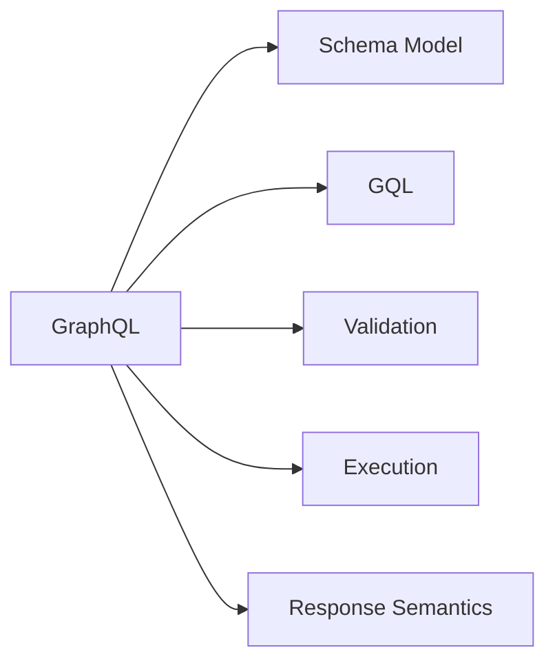

### 2. Schema

#### 2.1 GraphQL Schema

A GraphQL schema is the specification-defined, typed structure of an API: its types, fields, arguments, and root operation types.

The schema is required; SDL is not.

#### 2.2 Schema Model

The GraphQL specification defines an abstract schema model that all GraphQL schemas must conform to.

Implementations may represent that model internally however they want.

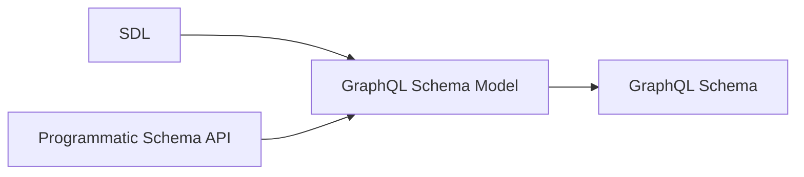

#### 2.3 SDL

SDL (Schema Definition Language) is GraphQL's standardized language for expressing the schema model.

A server does not have to accept SDL or use it internally.

A custom schema-definition mechanism is compatible with GraphQL if it produces a valid GraphQL schema.

SDL describes the GraphQL schema, not implementation details such as resolver code or database access.

### 3. Query Language (GQL)

#### 3.1 GQL Is Standardized

GQL is the actual GraphQL query language defined by the specification.

A GraphQL implementation must support GraphQL documents written in GQL; a server-specific query syntax is not a replacement for GQL.

#### 3.2 Basic Structure

```graphql
query GetUser($id: ID!) {
  user(id: $id) {
    id
    name
  }
}
```

| Syntax       | Meaning        |
| ------------ | -------------- |
| `query`      | Operation type |
| `GetUser`    | Operation name |
| `$id`        | Variable       |
| `user`       | Field          |
| `id`, `name` | Nested fields  |
| `{ ... }`    | Selection set  |

#### 3.3 Object vs. Leaf Fields

The return type of a field determines whether it can have a selection set.

| Return type | Selection set |
| ----------- | ------------- |
| Object      | Required      |
| Leaf type   | Forbidden     |

Scalars and enums are leaf types.

#### 3.4 The Important Asymmetry

| Schema                                            | GQL                                        |
| ------------------------------------------------- | ------------------------------------------ |
| GraphQL standardizes the schema model             | GraphQL standardizes the language itself   |
| Implementations may construct schemas differently | Implementations must support GQL semantics |
| SDL is one representation                         | Parsed representations may vary internally |

### 4. Request

#### 4.1 A GQL Document Is Not a Request

A GQL document describes an operation; a request submits that operation for execution.

A GraphQL request can provide:

* A document
* An operation selection
* Variable values

The GraphQL specification defines these concepts, but not a universal in-process API for passing them around.

#### 4.2 In-Process Request APIs

A library might expose an API such as:

```ts
execute({
  schema,
  document,
  variables
})
```

The API and in-memory representations are implementation-specific.

The `document` may be a parsed representation rather than GQL text, but it must faithfully represent a GraphQL document.

Variable values must satisfy the variable definitions in the document.

#### 4.3 Transport

GraphQL core does not require HTTP, a URL, JSON request bodies, or a particular endpoint.

A transport can deliver a request through HTTP, WebSockets, an in-process function call, or another mechanism.

#### 4.4 GraphQL over HTTP

GraphQL over HTTP is a separate standard for carrying GraphQL requests and responses over HTTP.

It is widely implemented, but HTTP is not required by core GraphQL.

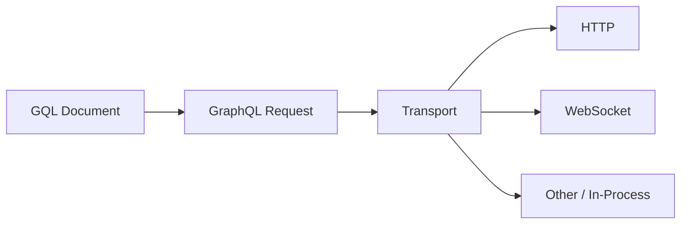

### 5. Execution

#### 5.1 What Execution Is

Execution evaluates a valid GraphQL operation against a schema according to GraphQL's execution semantics.

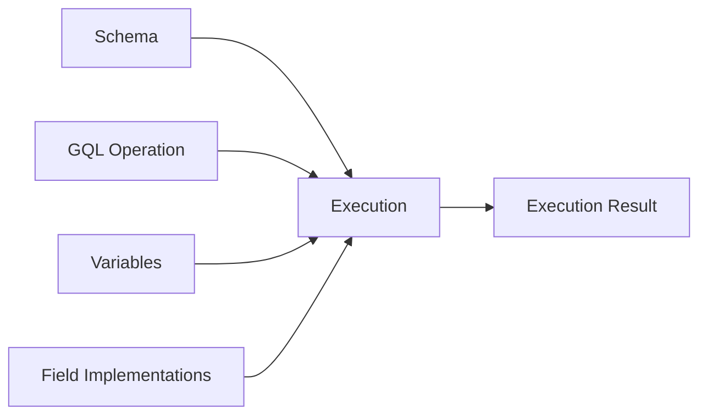

#### 5.2 What the Specification Defines

The specification defines how execution handles:

* Field selection
* Arguments and variables
* Nested selections
* Aliases and fragments
* Nullability
* Field errors
* Value completion

Different conforming execution engines should therefore have the same GraphQL-level semantics for equivalent inputs.

#### 5.3 What the Server Defines

GraphQL does not define how a field obtains its data.

A field may use a database, another service, a cache, or arbitrary application logic.

These application-specific implementations are commonly called **resolvers**.

| GraphQL specifies         | Server implements            |
| ------------------------- | ---------------------------- |
| How fields are executed   | What a field actually does   |
| How arguments are applied | How data is retrieved        |
| Nullability behavior      | Database/service interaction |
| Error propagation rules   | Application-specific errors  |

### 6. Response

#### 6.1 Execution Result

Execution produces a GraphQL result containing `data`, errors, or both as appropriate.

The `data` structure follows the selection structure of the operation.

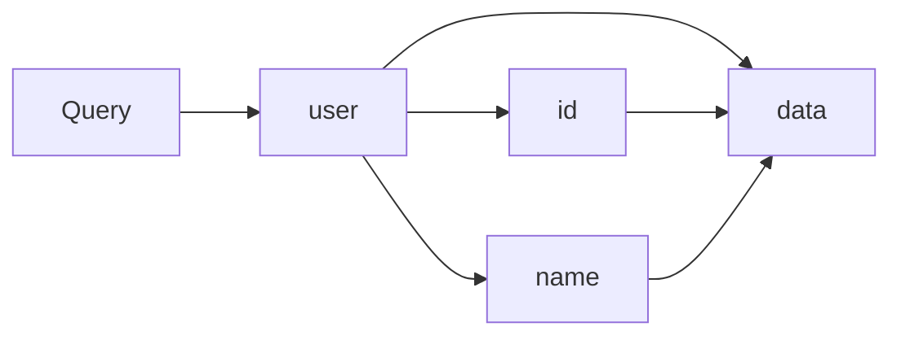

#### 6.2 Errors

GraphQL defines error semantics and a structured error representation.

An error contains at least `message` and may include `locations`, `path`, and `extensions`.

Errors are part of the GraphQL contract, not purely server-specific behavior.

#### 6.3 Response vs. Serialization

GraphQL defines the response structure and semantics; JSON is not the fundamental GraphQL data model.

JSON is a representation capable of carrying that structure.

The transport determines how the response is serialized and transmitted.

### 7. The Complete Boundary Map

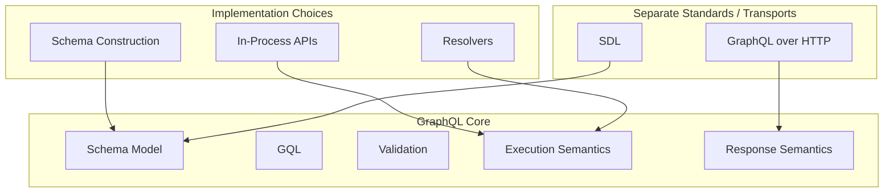

#### 7.1 What GraphQL Core Defines

| Area           | Core GraphQL        |
| -------------- | ------------------- |
| Schema         | Schema model        |
| Query language | GQL                 |
| Validation     | Validation rules    |
| Execution      | Execution semantics |
| Response       | Response semantics  |

#### 7.2 What Is Standardized Separately

| Component         | Role                                        |
| ----------------- | ------------------------------------------- |
| SDL               | Standard language for expressing schemas    |
| GraphQL over HTTP | Standard for transporting GraphQL over HTTP |

#### 7.3 What Is Implementation-Specific

* Schema construction
* Internal schema representation
* In-process request APIs
* Internal GQL representation
* Resolver implementations
* Database and service integration

#### 7.4 What Core GraphQL Does Not Require

* HTTP
* A `/graphql` endpoint
* JSON request bodies
* A specific programming language
* A specific server framework
* A specific database

### 8. Chapter 1 Summary

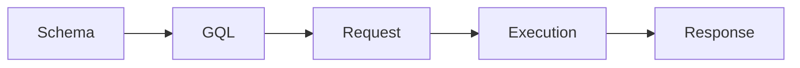

| Concept   | Standardized by GraphQL        | Flexible                              |
| --------- | ------------------------------ | ------------------------------------- |
| Schema    | Schema model                   | Construction and representation       |
| SDL       | SDL language                   | Whether the server accepts or uses it |
| GQL       | Language and semantics         | Parser and internal representation    |
| Request   | Request concepts and semantics | In-process API and transport          |
| Execution | Execution semantics            | Engine implementation and resolvers   |
| Response  | Response semantics             | Serialization and transport           |

The central asymmetry:

> **GraphQL standardizes the schema model, but it standardizes GQL itself as a language.**

The surrounding mechanisms can vary, provided their GraphQL behavior conforms to the specification.

## Chapter 2 — SDL and the Schema Model

### 1. SDL and the Schema Model

#### 1.1 GraphQL Schema

A GraphQL schema is a typed description of an API: its types, fields, arguments, directives, and root operation types.

#### 1.2 SDL as a Schema Representation

SDL (Schema Definition Language) is the standardized GraphQL language for describing a schema.

A server may accept SDL, construct the schema programmatically, or use another mechanism. The resulting schema must conform to the GraphQL Schema Model.

#### 1.3 Schema Model vs. Implementation

The Schema Model defines what the schema means; the implementation chooses how to represent and construct it.

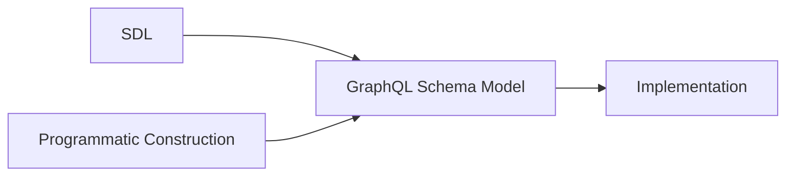

### 2. Object Types

#### 2.1 Object Type Definitions

An object type defines a set of fields:

```graphql
type User {
  id: ID!
  name: String!
}
```

`User` is the type name; `id` and `name` are fields.

#### 2.2 Field Definitions

A field definition has the form:

```graphql
name: Type
```

The type may be a named type or a type modified by `[]` and `!`.

```graphql
name: String!
posts: [Post!]!
```

#### 2.3 Object Type Relationships

An object field can use another object type:

```graphql
type Post {
  author: User!
}
```

This creates a relationship between `Post` and `User`.

#### 2.4 Object Type Extensions

An existing object type can be extended:

```graphql
type User {
  id: ID!
}

extend type User {
  name: String!
}
```

Extensions contribute to the existing type; they do not create another type.

### 3. Leaf Types

#### 3.1 Built-in Scalars

GraphQL defines five built-in scalar types:

| Scalar    | Represents            |
| --------- | --------------------- |
| `Int`     | Integer               |
| `Float`   | Floating-point number |
| `String`  | Text                  |
| `Boolean` | `true` or `false`     |
| `ID`      | Identifier            |

Scalars are leaf types, so they cannot have selection sets.

#### 3.2 Custom Scalars

A schema can define its own scalar types:

```graphql
scalar DateTime
```

This declares `DateTime` as a scalar; the implementation defines how its values are parsed and serialized.

#### 3.3 Scalar Extensions

A custom scalar can also be extended:

```graphql
scalar DateTime

extend scalar DateTime
```

The extension mechanism allows schema definitions to be assembled from multiple SDL documents.

#### 3.4 Enum Types

An enum is a leaf type whose value must be one of a fixed set of named values:

```graphql
enum PostSort {
  NEWEST
  OLDEST
  TOP
}
```

Enum names follow GraphQL `Name` syntax. Uppercase is a convention, not a requirement.

#### 3.5 Enum Extensions

An enum can be extended with additional values:

```graphql
enum PostSort {
  NEWEST
}

extend enum PostSort {
  TOP
}
```

### 4. Type Modifiers

#### 4.1 Non-Null

`!` wraps a type and disallows `null`.

```graphql
name: String!
```

For an output field, `!` means the value cannot be `null` when the field is selected.

For an input field, `!` also makes the field required: it cannot be omitted or set to `null`.

#### 4.2 Lists

`[]` wraps a type and makes it a list:

```graphql
posts: [Post]
```

A list may contain `null` elements unless its element type is Non-Null.

#### 4.3 Combining Type Modifiers

`[]` and `!` can be nested:

| Type       | Meaning                                 |
| ---------- | --------------------------------------- |
| `Post`     | Nullable `Post`                         |
| `Post!`    | Non-Null `Post`                         |
| `[Post]`   | Nullable list of nullable `Post` values |
| `[Post!]`  | Nullable list of Non-Null `Post` values |
| `[Post]!`  | Non-Null list of nullable `Post` values |
| `[Post!]!` | Non-Null list of Non-Null `Post` values |

### 5. Input Types

#### 5.1 Input Object Definitions

Input objects define structured values supplied to fields:

```graphql
input PostFilter {
  topicId: ID!
  sort: PostSort
}
```

#### 5.2 Input Fields

Input fields use the same type syntax as output fields, but must use input types.

An input field is nullable and optional by default.

`!` makes it required.

#### 5.3 Input vs. Output Types

|             | Input types                   | Output types                                |
| ----------- | ----------------------------- | ------------------------------------------- |
| Used for    | Values supplied to fields     | Values returned by fields                   |
| May contain | Scalars, enums, input objects | Scalars, enums, objects, interfaces, unions |
| Example     | `input PostFilter`            | `type Post`                                 |

#### 5.4 Input Cycles

Input objects may reference one another, but a cycle consisting only of required singular fields is invalid because no finite value can satisfy it.

```graphql
input A {
  b: B!
}

input B {
  a: A!
}
```

#### 5.5 Input Object Extensions

Input objects can be extended:

```graphql
input PostFilter {
  topicId: ID!
}

extend input PostFilter {
  sort: PostSort
}
```

#### 5.6 Arguments

Arguments belong to field definitions:

```graphql
type Query {
  post(id: ID!): Post
}
```

`id` is an argument; `post` is a field.

#### 5.7 Default Values

Arguments and input fields can have default values:

```graphql
type Query {
  posts(limit: Int = 20): [Post!]!
}
```

The default is used when the value is omitted.

### 6. Interfaces and Unions

#### 6.1 Interfaces

An interface defines fields that implementing types must provide:

```graphql
interface Content {
  id: ID!
}
```

#### 6.2 Interface Implementation

An object implements an interface with `implements`:

```graphql
type Post implements Content {
  id: ID!
  title: String!
}
```

`implements` establishes a conformance relationship; it does not inherit fields.

#### 6.3 Multiple Interface Implementations

An object can implement multiple interfaces. Their names are separated by `&`:

```graphql
type Post implements Content & Postable {
  id: ID!
  author: User!
  title: String!
}
```

The object must satisfy every interface it declares.

An interface can also implement multiple interfaces using the same syntax.

#### 6.4 Interfaces Implementing Interfaces

Interfaces can implement other interfaces:

```graphql
interface Content {
  id: ID!
}

interface Postable implements Content {
  id: ID!
  author: User!
}
```

The implementing interface must satisfy the interface contract.

#### 6.5 Interface Extensions

Interfaces can be extended:

```graphql
interface Content {
  id: ID!
}

extend interface Content {
  author: User!
}
```

#### 6.6 Unions

A union represents one of several object types:

```graphql
union SearchResult = Post | Comment
```

A union defines possible object types but has no fields of its own.

#### 6.7 Union Extensions

A union can be extended with additional object types:

```graphql
union SearchResult = Post

extend union SearchResult = Comment
```

### 7. Directives

#### 7.1 Directive Definitions

A directive definition declares its name, arguments, whether it is repeatable, and its allowed locations:

```graphql
directive @auth(role: String!) on FIELD_DEFINITION
```

The general form is:

```graphql
directive @name(arguments) repeatable? on LOCATION | LOCATION | ...
```

#### 7.2 Directive Applications

A directive is applied by placing `@name` after the construct at an allowed location:

```graphql
type Post @auth(role: "admin") {
  title: String!
}
```

The directive's definition determines whether that location is valid and which arguments it accepts.

#### 7.3 Directive Arguments and Defaults

Directive arguments use input types and may have default values:

```graphql
directive @tag(name: String = "default") on FIELD_DEFINITION
```

#### 7.4 Directive Locations

The `on` clause specifies where the directive may be used. Multiple locations are separated by `|`.

```graphql
directive @foo on FIELD_DEFINITION | OBJECT | INPUT_FIELD_DEFINITION
```

This means `@foo` may be used on object fields, object type definitions, or input fields.

GraphQL defines a fixed set of directive locations.

**Schema locations:**

| Location                 | Applies to                             |
| ------------------------ | -------------------------------------- |
| `SCHEMA`                 | Schema definition                      |
| `SCALAR`                 | Scalar definition                      |
| `OBJECT`                 | Object type definition                 |
| `FIELD_DEFINITION`       | Object or interface field definition   |
| `ARGUMENT_DEFINITION`    | Field or directive argument definition |
| `INTERFACE`              | Interface definition                   |
| `UNION`                  | Union definition                       |
| `ENUM`                   | Enum definition                        |
| `ENUM_VALUE`             | Enum value                             |
| `INPUT_OBJECT`           | Input object definition                |
| `INPUT_FIELD_DEFINITION` | Input object field definition          |

**Executable GQL locations:**

| Location          | Applies to            |
| ----------------- | --------------------- |
| `FIELD`           | Field selection       |
| `FRAGMENT_SPREAD` | Named fragment spread |
| `INLINE_FRAGMENT` | Inline fragment       |

A directive applied at a location not declared by its definition is invalid. ([spec.graphql.org](https://spec.graphql.org/September2025/))

#### 7.5 Repeatable Directives

A directive can be declared `repeatable`:

```graphql
directive @tag(name: String!) repeatable on FIELD_DEFINITION
```

Without `repeatable`, the same directive may not be applied more than once at the same location. With it, multiple applications are allowed.

For example:

```graphql
type Post {
  title: String!
    @tag(name: "searchable")
    @tag(name: "indexed")
}
```

#### 7.6 Built-in Directives

GraphQL defines five built-in directives:

| Directive      | Locations                                                                         | Purpose                                           |
| -------------- | --------------------------------------------------------------------------------- | ------------------------------------------------- |
| `@skip`        | `FIELD`, `FRAGMENT_SPREAD`, `INLINE_FRAGMENT`                                     | Skip a selection when `if` is `true`              |
| `@include`     | `FIELD`, `FRAGMENT_SPREAD`, `INLINE_FRAGMENT`                                     | Include a selection only when `if` is `true`      |
| `@deprecated`  | `FIELD_DEFINITION`, `ARGUMENT_DEFINITION`, `INPUT_FIELD_DEFINITION`, `ENUM_VALUE` | Mark a schema element as deprecated               |
| `@specifiedBy` | `SCALAR`                                                                          | Associate a scalar with an external specification |
| `@oneOf`       | `INPUT_OBJECT`                                                                    | Require exactly one input field to be supplied    |

Their definitions and behavior are standardized by GraphQL. ([spec.graphql.org](https://spec.graphql.org/September2025/))

For example:

```graphql
input PostTarget @oneOf {
  postId: ID
  commentId: ID
}
```

`@oneOf` applies to the input object itself. Exactly one of its fields must be supplied.

### 8. Schema Definitions

#### 8.1 Schema Definition

A schema can explicitly define its root operation mappings:

```graphql
schema {
  query: Query
  mutation: Mutation
  subscription: Subscription
}
```

There is at most one base `schema` definition in an assembled schema.

#### 8.2 Root Operation Mappings

A schema definition maps operation types to object types:

```graphql
schema {
  query: RootQuery
}
```

The operation types are `query`, `mutation`, and `subscription`; their mapped types must be object types.

If the schema uses the conventional root type names `Query`, `Mutation`, and `Subscription`, the explicit `schema` definition may be omitted.

The omission is shorthand for the corresponding mappings; it does not create special types.

#### 8.3 Schema Extensions

A schema can be extended:

```graphql
schema {
  query: Query
}

extend schema {
  mutation: Mutation
}
```

Multiple schema extensions may be assembled into the same schema.

#### 8.4 The Single Schema Definition Rule

One assembled schema may contain at most one base `schema` definition. Its root mappings must not be defined again by another base `schema` definition.

### 9. SDL Source Syntax

#### 9.1 Names

GraphQL names begin with `_` or an ASCII letter and may then contain `_`, letters, and digits:

```text
[_A-Za-z][_0-9A-Za-z]*
```

Names are used for types, fields, arguments, directives, enum values, and other schema elements.

#### 9.2 Descriptions

Descriptions are part of the GraphQL type system and can be attached to schema elements using string literals:

```graphql
"""A user of the platform."""
type User {
  """The user's display name."""
  name: String!
}
```

Descriptions can be provided for types, fields, arguments, input fields, enum values, and directives.

They are exposed through introspection and do not affect execution behavior.

#### 9.3 Comments

Comments begin with `#` and continue to the end of the line:

```graphql
# A user of the platform.
type User {
  id: ID!
}
```

Comments are ignored by the parser.

#### 9.4 Whitespace

Whitespace separates tokens but does not otherwise determine structure. Indentation and line breaks are not significant.

#### 9.5 Commas

Commas are optional and insignificant:

```graphql
type User {
  id: ID!,
  name: String!
}
```

is equivalent to:

```graphql
type User {
  id: ID!
  name: String!
}
```

#### 9.6 Lexical Tokens

SDL is parsed as a sequence of tokens. Whitespace can be necessary to separate tokens, but the parser does not rely on indentation or line structure.

For example:

```graphql
type User {
  id: ID!
  name: String!
}
```

The `name` token begins the next field because of its position in the grammar, while `@` after a field type begins a directive attached to that field.

GraphQL source is tokenized before parsing. Whitespace and comments separate tokens but do not define structural nesting.

Names use:

```text
[_A-Za-z][_0-9A-Za-z]*
```

Punctuators such as `@`, `|`, `&`, `[`, `]`, `{`, `}`, `(`, `)`, `:`, and `!` have defined grammatical meanings.


### 10. Schema Construction and Validation

#### 10.1 Parsing SDL

Parsing checks whether an SDL document follows GraphQL's grammar.

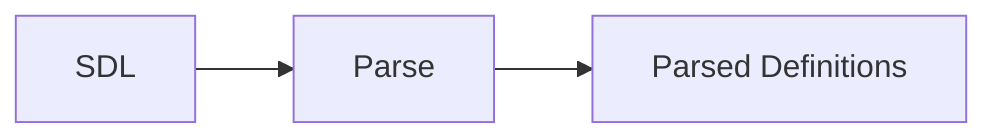

A parsed document is not necessarily a valid schema.

#### 10.2 Schema Assembly

Multiple parsed documents can be combined into one schema.

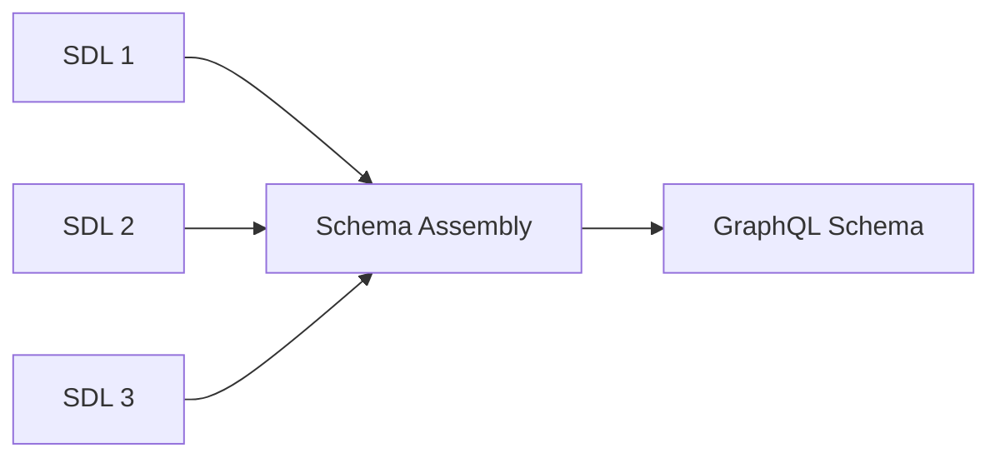

SDL has no file-level visibility model; the assembler determines which definitions belong to the same schema.

#### 10.3 Declaration Order

Definitions are not interpreted as sequential execution statements. References can point to definitions that appear later in the same schema document or in another assembled document.

```graphql
type Post {
  author: User
}

type User {
  id: ID!
}
```

This is valid.

#### 10.4 Cross-Document Assembly

Definitions in different SDL documents can contribute to the same schema:

```graphql
# user.graphql
type User {
  id: ID!
}
```

```graphql
# profile.graphql
extend type User {
  avatar: String
}
```

If both documents are assembled into one schema, `User` contains both fields.

#### 10.5 Schema Validation

Schema validation checks the assembled schema against GraphQL's type-system rules.

Examples include:

* A referenced type must exist.
* A field name must be unique within its type.
* An object implementing an interface must satisfy its fields.
* A union member must be an object type.
* Input positions must use input types.
* Extensions must be compatible with the type they extend.
* Directives must be used at allowed locations.
* Required input cycles are invalid.

### 11. GraphQL Schema Model

#### 11.1 SDL → Schema Model

SDL is a standardized representation of the GraphQL Schema Model.

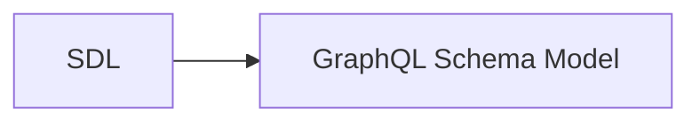

#### 11.2 Alternative Schema Construction

SDL is not required as the mechanism for constructing a schema. An implementation may construct the same model programmatically or through another mechanism.

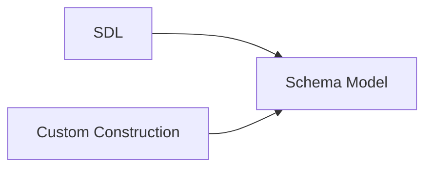

#### 11.3 Schema Model → Implementation

The implementation turns the schema model into whatever internal representation is needed for validation, execution, introspection, and other server functionality.

The internal representation is not standardized.

#### 11.4 Portable vs. Implementation-Specific

| Portable               | Implementation-specific        |
| ---------------------- | ------------------------------ |
| GraphQL Schema Model   | Internal schema representation |
| SDL representation     | Schema construction API        |
| GQL against the schema | Resolver implementation        |
| Schema semantics       | Server architecture            |

**Core idea:** SDL defines the GraphQL schema; the implementation decides how that schema is constructed and represented.

Yes. There was substantial repetition in the draft, particularly around schema-defined validity, fragments, and variables. I also had several sections that restated distinctions already established rather than adding reference value.

The biggest reductions are:

* Remove repeated explanations of fields being schema-defined.
* Collapse basic selection-set material.
* Treat literal values as a compact syntax reference rather than re-explaining their typing.
* Combine variable rules instead of separately restating compatibility/default behavior.
* Reduce fragment sections to the distinctions that matter: named vs. inline, type conditions, composition/cycles.
* Remove the final "GraphQL and the Schema" section because it largely repeats Chapter 2.
* Remove the final mental-model section's repetition of the chapter; retain only a compact summary.

The resulting chapter should be closer to this:

## Chapter 3 — GraphQL Query Language

### 1. Documents and Operations

#### 1.1 Documents

A GraphQL document contains operation definitions and fragment definitions.

#### 1.2 Operations

An operation is an executable unit:

```graphql
query { ... }
mutation { ... }
subscription { ... }
```

The operation type determines its execution semantics.

#### 1.3 Named and Anonymous Operations

Operations may be named:

```graphql
query GetUser {
  user(id: "123") {
    name
  }
}
```

or anonymous:

```graphql
{
  user(id: "123") {
    name
  }
}
```

An anonymous operation is allowed only when the document contains one operation.

A document containing multiple operations requires the request to identify the operation by name.

### 2. Selection Sets

#### 2.1 Fields and Nested Selections

A selection set contains fields, with nested selection sets for object-valued fields:

```graphql
query {
  post(id: "123") {
    title
    author {
      name
    }
  }
}
```

The available selections are determined by the schema type at each level.

#### 2.2 Arguments

Fields may provide arguments:

```graphql
posts(topicId: "42", limit: 20) {
  title
}
```

Arguments supply values to arguments declared by the schema.

### 3. Values and Variables

#### 3.1 Value Literals

GraphQL supports these literal value forms:

| Value        | Example             |
| ------------ | ------------------- |
| Int          | `20`                |
| Float        | `3.14`              |
| String       | `"text"`            |
| Boolean      | `true`              |
| Null         | `null`              |
| Enum         | `NEWEST`            |
| List         | `["a", "b"]`        |
| Input object | `{ topicId: "42" }` |

The expected schema type determines whether a literal is valid.

#### 3.2 Variables

Variables provide values separately from the document:

```graphql
query GetPosts($limit: Int!) {
  posts(limit: $limit) {
    id
  }
}
```

Variables are declared on the operation and supplied by the request.

#### 3.3 Variable Defaults

Variables may have defaults:

```graphql
query GetPosts($limit: Int! = 20) {
  posts(limit: $limit) {
    id
  }
}
```

The default is used when the variable is not provided.

#### 3.4 Variable Type Compatibility

A variable can only be used where its declared type is compatible with the argument's type. This is validated before execution.

### 4. Aliases and Field Merging

#### 4.1 Aliases

An alias changes a field's response name without changing the field selected:

```graphql
{
  displayName: name
}
```

#### 4.2 Field Merging

Selections with the same response name are merged when their field and arguments are compatible:

```graphql
{
  posts(sort: NEWEST) {
    id
  }

  posts(sort: NEWEST) {
    title
  }
}
```

Conceptually:

```graphql
{
  posts(sort: NEWEST) {
    id
    title
  }
}
```

Argument order does not matter.

#### 4.3 Field Conflicts

Selections with the same response name but incompatible fields or arguments produce a validation error.

Aliases can give them different response names.

### 5. Fragments

#### 5.1 Named Fragments

A named fragment defines a reusable selection set:

```graphql
fragment UserFields on User {
  id
  name
}
```

It is included with a fragment spread:

```graphql
user(id: "123") {
  ...UserFields
}
```

#### 5.2 Inline Fragments

An inline fragment provides type-specific selections without defining a reusable fragment:

```graphql
search {
  ... on Post {
    title
  }
}
```

#### 5.3 Type Conditions

`on Type` is a type condition. The fragment's selections apply when the current value is compatible with that type.

Object, interface, and union types can be used as type conditions.

#### 5.4 Fragment Composition

Fragments can spread other fragments. Fragment spreads must be type-compatible with their location and must not form cycles.

### 6. Directives

#### 6.1 Directive Applications

Directives are applied with `@` and may take arguments:

```graphql
name @include(if: $showName)
```

The directive definition determines where it may be used and what arguments it accepts.

#### 6.2 Built-in Execution Directives

`@skip` omits a selection when `if` is true.

`@include` includes a selection only when `if` is true.

Both can apply to fields, fragment spreads, and inline fragments.

#### 6.3 Type Selection vs. Runtime Conditions

| Mechanism            | Based on             |
| -------------------- | -------------------- |
| Inline fragment      | Current GraphQL type |
| `@include` / `@skip` | Runtime Boolean      |

An inline fragment is type-directed selection, not general conditional control flow.

### 7. Syntax Details

#### 7.1 Names and Keywords

GraphQL names begin with `_` or an ASCII letter and may then contain `_`, letters, and digits.

`query`, `mutation`, and `subscription` are operation-type keywords.

#### 7.2 Whitespace, Commas, and Comments

Whitespace and line breaks do not determine structure. Commas are optional and insignificant. Comments begin with `#` and run to the end of the line.

### 8. GQL and the Schema

#### 8.1 Schema-Defined Validity

The schema determines which fields, arguments, and types are valid in a GraphQL document.

#### 8.2 Parsing vs. Validation

Parsing checks GraphQL syntax. Validation checks whether the parsed document is valid against the schema.

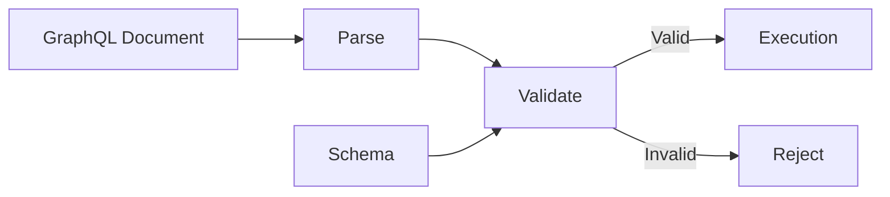

### 9. Chapter Summary

GraphQL query language is a declarative language for selecting data from a schema.

| Construct      | Purpose                               |
| -------------- | ------------------------------------- |
| Operation      | Defines an executable operation       |
| Selection set  | Selects fields                        |
| Argument       | Supplies a field input                |
| Variable       | Supplies runtime input                |
| Alias          | Changes a response name               |
| Fragment       | Reuses selections                     |
| Type condition | Restricts fragment selections by type |
| Directive      | Modifies an executable construct      |

The document describes **what is requested**; execution determines **what that request does**.

## Chapter 4 — GraphQL Execution

Execution prepares variables, collects fields, obtains their values, and completes those values into a result.

The implementation examples use GraphQL.js v16. GraphQL Tools supplies the resolver-map and schema-transformation APIs used with it.

### 1. Preparing Runtime Variables

#### 1.1 Selecting the Operation

The engine selects one operation from the validated document before preparing its variables.

An unknown operation name, or an omitted name when several operations exist, prevents execution. Only the selected operation executes.

#### 1.2 Input Coercion

Input coercion accepts, rejects, or converts values according to their declared input types.

Variable coercion happens before any field executes. A valid document can still fail because its supplied variables are invalid.

#### 1.3 Built-in Scalar Inputs

| Input type | Accepted non-null runtime values |
| --- | --- |
| `Int` | Integers from −2³¹ through 2³¹ − 1 |
| `Float` | Finite numbers representable as double-precision values, including integers |
| `String` | Strings |
| `Boolean` | Booleans |
| `ID` | Strings or integers, interpreted according to the service's ID format |

`"2"` is invalid for `Int`; `2` is valid. `String` does not stringify arbitrary inputs, and `Boolean` does not apply truthiness.

#### 1.4 Other Input Types

| Input type | Coercion |
| --- | --- |
| List | Coerce each item. Wrap a non-list, non-null value as one item. |
| Input object | Coerce declared fields recursively; reject unknown fields. |
| Enum | Require an exact, case-sensitive member name. |
| OneOf input object | Require exactly one supplied field with a non-null, valid value. |
| Custom scalar | Apply the scalar's own input contract. |

Singleton list coercion applies recursively:

| Declared type | Supplied value | Coerced value |
| --- | --- | --- |
| `[Int]` | `2` | `[2]` |
| `[[Int]]` | `2` | `[[2]]` |

An empty list is valid even for `[Int!]!`.

For a OneOf input object, all fields except the supplied field must be absent. Explicit null does not count as absence.

#### 1.5 Absence, Null, and Defaults

| Supplied variable value | Result |
| --- | --- |
| Omitted, with a variable default | Use the default |
| Omitted, without a default | Remain absent if nullable; otherwise fail |
| Explicit `null` | Accept if nullable; otherwise fail |
| Other value | Apply input coercion |

Defaults replace absence, not null or invalid values. A non-null variable with a default can be omitted but cannot be explicitly null.

Input object fields follow the same rules using their schema defaults. Defaults on nested fields do not create an omitted or null parent object.

Extra entries in the top-level variables map are ignored. Unknown fields inside an input object are rejected.

#### 1.6 Input Representation

Core GraphQL requires neither JSON nor a canonical intermediate format. The engine's input representation must preserve distinctions needed by coercion, including strings versus numbers and absence versus null.

JSON has one number representation. JSON `5.0` can satisfy `Int` because it has no fractional part; the GraphQL literal `5.0` is a float literal and cannot.

Enum inputs use strings in JSON and unquoted names in GraphQL literals. Other formats can use distinct symbolic values. [Input coercion](https://spec.graphql.org/September2025/#sec-Scalars.Input-Coercion)

#### 1.7 Validation vs. Variable Coercion

| Input | Checked when |
| --- | --- |
| Literal written in the document | Document validation |
| Declared variable type at its usage location | Document validation |
| Value supplied for a variable | Variable coercion |

Validation checks input object literals recursively, including field names, uniqueness, required fields, and value types.

Singleton coercion applies to values, not variable declarations. A variable declared as `Int` cannot be used where `[Int]` is expected. A variable declared as `[Int]` can receive the runtime value `2`.

### 2. Collecting Fields

#### 2.1 Collection for the Current Object

Field collection determines which selections apply to the current object. Execution starts with the operation's root selection set, then collects child selections as field values become available.

Collection follows applicable fragments and evaluates `@skip` and `@include` using the prepared variables.

```graphql
query GetUser($showName: Boolean!) {
  user(id: "7") {
    id
    name @include(if: $showName)
  }
}
```

The engine first collects the root field `user`. If that field returns an object and `showName` is false, collection for the user retains only `id`. The `name` resolver is not called, and `name` is absent from the response.

With both directives present, a selection survives only when `skip` is false and `include` is true.

#### 2.2 Directive Processing Stages

Directives are structured annotations. Their definitions specify where they are allowed; the engine or other tooling supplies their behavior.

| Directive | Processing role |
| --- | --- |
| `@skip`, `@include` | Filter selections during collection |
| `@oneOf` | Constrain input objects |
| `@deprecated` | Supply schema metadata |

There is no universal stage where all directives run. Declaring a custom directive does not implement its behavior.

Custom collection hooks are framework-specific. GraphQL Ruby, for example, provides a directive `include?` hook. Extension code remains responsible for preserving GraphQL's required behavior. [Directive runtime hooks](https://graphql-ruby.org/type_definitions/directives#runtime-hooks)

#### 2.3 Grouping by Response Name

Surviving selections are grouped by response name. Each group executes once for the current object, with its child selections combined:

```graphql
{
  first: user(id: "7") { id }
  first: user(id: "7") { name }
  second: user(id: "7") { name }
}
```

| Group | Execution |
| --- | --- |
| `first` | Resolve `user(id: "7")` once, then execute `id` and `name` |
| `second` | Resolve `user(id: "7")` separately, then execute `name` |

Grouping applies to one object execution. It does not cache results across response positions.

#### 2.4 Why Groups Are Unambiguous

Document validation rejects conflicting selections before collection begins.

For selections that can apply to the same object:

* Field names and argument expressions must match.
* Input object arguments are compared recursively.
* Argument order and input object field order do not matter; list order does.
* Different variable names are different expressions, even if their runtime values match.
* Combined child selections must also be free of conflicts.

These selections conflict:

```graphql
first: user(filter: { id: "7" }) { name }
first: user(filter: { id: "8" }) { name }
```

Both arguments can satisfy the same input type while differing as expressions. Replacing the second field with `first: topic(...)` would also conflict.

Fragments on distinct concrete object types can use different fields or arguments under one response name. Their response shapes must still be compatible, including leaf types and list/non-null wrappers. [Field-merging validation](https://spec.graphql.org/September2025/#sec-Field-Selection-Merging)

### 3. Resolving Fields

#### 3.1 Field Resolvers and Resolver Maps

A field resolver is a function that reads, fetches, or computes one field's value.

A resolver map associates schema types and fields with their implementations:

```javascript
const resolvers = {
  Query: {
    greeting: () => "Hello",
  },
};
```

The structure is **type name → field name → resolver**. This example implements the schema field `Query.greeting`.

This resolver-map structure is a GraphQL Tools API, not part of core GraphQL.

#### 3.2 Registering Resolvers

Registration combines schema declarations with their implementations before requests execute. `makeExecutableSchema` builds an executable schema from an SDL string, `typeDefs`, and a resolver map:

```javascript
import { makeExecutableSchema } from "@graphql-tools/schema";
import { graphql } from "graphql";

const typeDefs = `
  type Query {
    greeting: String!
  }
`;

const resolvers = {
  Query: {
    greeting: () => "Hello",
  },
};

const schema = makeExecutableSchema({ typeDefs, resolvers });
const result = await graphql({ schema, source: "{ welcome: greeting }" });
```

`makeExecutableSchema` parses the SDL string; a parsed SDL document is also accepted.

The resulting schema is a GraphQL.js `GraphQLSchema` containing the registered callbacks. `graphql()` executes the document supplied as `source` against that schema:

```json
{ "data": { "welcome": "Hello" } }
```

The engine calls `Query.greeting`; the alias controls the response key.

GraphQL.js also supports constructing schema types directly in JavaScript, with callbacks on their field definitions. `graphql()` receives the resulting schema, not a resolver map.

#### 3.3 Execution Entry Points

| GraphQL.js API | Work performed |
| --- | --- |
| `parse(source)` | Parse document text into an abstract syntax tree (AST) |
| `validate(schema, document)` | Check the parsed document against the schema |
| `execute(options)` | Select an operation, coerce variables, and execute a parsed document |
| `graphql(options)` | Check the schema, parse the source, validate the document, and execute |

To validate without executing:

```javascript
import { parse, validate } from "graphql";

const document = parse("{ greeting }");
const errors = validate(schema, document);
```

`parse()` throws on invalid syntax. `validate()` returns an error array, empty when valid. No field resolvers run.

Use `execute()` when parsing and validation are handled separately, such as when reusing a validated document. Validation must still apply to the current schema and rules; each execution still coerces its supplied variables.

The execution options include:

| Option | Purpose |
| --- | --- |
| `source` / `document` | Document text for `graphql()` / parsed document for `execute()` |
| `operationName` | Select an operation |
| `variableValues` | Supply variables |
| `rootValue` | Supply the initial parent value |
| `contextValue` | Supply shared application data |

Subscription streams use the separate `subscribe()` entry point in Section 8.

#### 3.4 Resolver-Map Entries

A field function is shorthand for a configuration object containing `resolve`:

```javascript
const shorthand = { Query: { greeting: () => "Hello" } };
const explicit = { Query: { greeting: { resolve: () => "Hello" } } };
```

A subscription field can also register `subscribe`, which supplies its event stream. Its `resolve` callback supplies a field value for each event.

Other schema types use different entries:

| Type kind | Entry |
| --- | --- |
| Object | Field resolvers; optional `__isTypeOf` to recognize values of the type |
| Interface or union | `__resolveType` to identify a value's concrete object type |
| Scalar | Scalar implementation for input and output coercion |
| Enum | Member names mapped to internal values |

Type callbacks sit directly beneath the type name. They are not field callbacks. Input objects have no field resolvers.

Root operation types are ordinary object types assigned to the query, mutation, and subscription roles. With `schema { query: ReadRoot }`, the map uses `ReadRoot`, not `Query`. Capitalization is a naming convention.

Ordinary keys must match schema types and fields. The map need not repeat every type or field; omitted field resolvers use default resolution.

GraphQL Tools reserves specific `__` keys for type configuration. The prefix does not make arbitrary names valid callbacks. [Resolver-map API](https://the-guild.dev/graphql/tools/docs/resolvers)

#### 3.5 Resolver Parameters

An explicitly registered GraphQL.js resolver receives four positional parameters:

```javascript
resolve(parent, args, context, info)
```

| Parameter | Contents |
| --- | --- |
| `parent` | Runtime value representing the object whose field is executing |
| `args` | Prepared arguments for this field |
| `context` | Application data shared across the execution |
| `info` | Engine metadata about this field execution |

The names are conventional; the positions define the API.

#### 3.6 Field Arguments

Before calling a resolver, the engine coerces literal arguments and substitutes already-coerced variable values.

For a schema field `posts(limit: Int = 10): [Post]`:

```graphql
query GetPosts($limit: Int = 20) {
  posts(limit: $limit) { id }
}
```

| Variables | `args.limit` |
| --- | --- |
| `{ "limit": 5 }` | `5` |
| `{}` | `20`, from the variable default |
| `{ "limit": null }` | `null` |

Removing the variable default leaves an omitted `$limit` absent, so the field's schema default supplies `10`.

The resolver reads the schema argument name, `args.limit`, regardless of the operation's variable name.

#### 3.7 Parent and Root Values

For a `user` field returning `User`, whose `manager` field also returns `User`:

```graphql
{
  user(id: "7") {
    manager {
      name
    }
  }
}
```

| Resolver | Parent value |
| --- | --- |
| `Query.user` | Supplied `rootValue` |
| `User.manager` | Value returned by `Query.user` |
| `User.name` | Value returned by `User.manager` |

Each resolver receives only its immediate parent.

Parent values can contain internal properties. `User.manager` could fetch a manager using `parent.managerId`, even though the client never selects that property.

The caller supplies `rootValue` as an execution option. It is runtime data, separate from the schema's root operation type. When omitted, GraphQL.js passes `undefined` to root field resolvers.

#### 3.8 Default Field Resolution

Without an explicit resolver, GraphQL.js reads the parent property matching the schema field name.

If `Query.user` returns `{ id: "7", name: "Alice" }`, default resolution supplies `User.id` and `User.name`. An alias such as `displayName: name` still reads `parent.name`.

A function-valued property is called as a method with `(args, context, info)` and the parent as `this`.

A schema can validate even when a selected field has no usable implementation. A missing property produces `undefined`, which becomes null in the response; a non-null field then fails.

#### 3.9 Asynchronous Resolvers

GraphQL.js resolvers can return a value or a Promise:

```javascript
const resolvers = {
  Query: {
    greeting: async () => "Hello",
  },
};
```

The engine awaits the value. Child resolvers receive the resolved value.

Function-valued properties called by the default resolver can also be asynchronous. A rejected Promise produces a field execution error, like a synchronous throw.

#### 3.10 Context

Context carries shared application data, such as the current user and database access:

```javascript
const result = await graphql({
  schema,
  source,
  contextValue: { database, currentUser },
});
```

The application supplies context before execution. Server frameworks can expose a callback for constructing it.

GraphQL.js passes the same context value to resolvers without cloning it or enforcing immutability. Context APIs and mutability differ between implementations.

Keep context properties stable during execution. Using one resolver to set data for another creates an execution-order dependency. Services referenced by context can manage their own state.

#### 3.11 Execution Lifetimes

| Value | Lifetime |
| --- | --- |
| Schema and registered resolvers | Reusable across operations |
| Root and context values | Supplied for an execution |
| `parent`, `args`, and `info` | Describe a field invocation |
| Services referenced by context | Lifetime of the service instance |

Creating a fresh context per request is an application pattern. It can contain both shared services and request-specific caches.

State captured by a registered resolver's closure remains shared wherever that function is reused.

#### 3.12 Execution Metadata

GraphQL.js supplies `info` to describe the current field execution:

| Property | Contents |
| --- | --- |
| `fieldName` | Schema field name |
| `fieldNodes` | AST nodes for the collected field selections |
| `returnType` | Declared output type |
| `path` | Position in the response |
| `schema` | Executable schema |
| `operation`, `fragments` | Parsed operation and fragment definitions |
| `variableValues` | Coerced variables |
| `rootValue` | Initial root value |

#### 3.13 Response Paths

A response path identifies a position inside `data`, using response names and zero-based list indices.

For a list-valued `friends` field in `{ viewer: user { friends { name } } }`, the first friend's name has path:

```json
["viewer", "friends", 0, "name"]
```

GraphQL.js represents `info.path` as linked segments with `key` and `prev`. Following `prev` retrieves path segments, not ancestor data.

#### 3.14 Return Types

`info.returnType` is a schema type instance, not a type inferred from the resolver's result.

For `[User!]!`, the instances nest as follows:

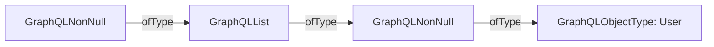

`String(info.returnType)` produces `"[User!]!"`.

#### 3.15 Resolver Wrappers

A resolver wrapper adds behavior around another resolver:

```javascript
const withUppercase = resolve =>
  async (parent, args, context, info) => {
    const value = await resolve(parent, args, context, info);
    return value.toUpperCase();
  };
```

Register `withUppercase(original)` in place of a resolver that returns a string.

This is an ordinary higher-order function. The engine calls the resulting resolver.

With `outer(inner(original))`, calls enter from outer to inner; results return in reverse order.

#### 3.16 Reading Query Directives

Resolvers can inspect directives on collected field selections through `info.fieldNodes`.

For this directive:

```graphql
directive @uppercase(enabled: Boolean! = true) on FIELD
```

For a query selection such as `greeting @uppercase`, choose one contributing node as `fieldNode`. GraphQL.js prepares the directive's arguments with:

```javascript
import { getDirectiveValues } from "graphql";

const options = getDirectiveValues(
  info.schema.getDirective("uppercase"),
  fieldNode,
  info.variableValues
);
```

Here `options` is `{ enabled: true }`, using the directive's default. With `@uppercase(enabled: false)`, it is `{ enabled: false }`; without the directive, it is `undefined`.

Application code supplies the behavior. Directives on operations and fragments remain on those nodes; they are not copied onto child fields.

A resolver runs after collection. Returning null cannot reproduce `@skip`'s omission of a field.

#### 3.17 Directives on Merged Selections

Repeatability applies to document locations, not resolver invocations:

| Applications | Requires `repeatable`? | `info.fieldNodes` |
| --- | --- | --- |
| Twice on one field selection | Yes | One node containing two directives |
| Once on each of two merged selections | No | Two nodes containing one directive each |

Merged selections can therefore supply conflicting settings for a custom directive. Its implementation must define how to combine them. Reading only the first field node gives that selection control.

`getDirectiveValues` reads the first matching directive on a node. Repeatable applications require inspecting the individual directive nodes.

Built-in `@skip` and `@include` filter each occurrence before grouping. A skipped occurrence does not cancel a surviving occurrence.

#### 3.18 Applying Schema Directives

A schema directive can select fields for resolver wrapping during setup. This example replaces the preceding query directive definition with a schema directive definition:

```graphql
directive @uppercase on FIELD_DEFINITION

type Query {
  greeting: String! @uppercase
}
```

Build `schema` from this SDL and the `Query.greeting` resolver. Then use the `withUppercase` wrapper from Section 3.15 to transform its annotated fields:

```javascript
import { defaultFieldResolver } from "graphql";
import { getDirective, mapSchema, MapperKind } from "@graphql-tools/utils";

const executableSchema = mapSchema(schema, {
  [MapperKind.OBJECT_FIELD]: field => {
    const directive = getDirective(schema, field, "uppercase")?.[0];
    if (!directive) return field;

    return {
      ...field,
      resolve: withUppercase(field.resolve ?? defaultFieldResolver),
    };
  },
});
```

`mapSchema` transforms constructed field configurations and returns a new schema. It does not directly edit the SDL syntax tree. `getDirective` reads the retained annotation.

Execute requests against `executableSchema`. The annotation is read during setup; the wrapper runs during field execution. [Schema directive implementation](https://the-guild.dev/graphql/tools/docs/schema-directives#implementing-schema-directives)

### 4. Completing Values

#### 4.1 Value Completion

Value completion turns a resolver's result into the response value required by its declared output type.

| Output type | Completion |
| --- | --- |
| Scalar or enum | Coerce the result to a response value |
| Object | Execute selected child fields |
| Interface or union | Identify the concrete object type, then execute child fields |
| List | Complete each item |
| Non-null | Require successful completion with a non-null value |

Document validation checks the operation against the schema. Completion checks the values produced by application code.

The engine can use native internal values. There is no required intermediate format; transport serialization happens after completion.

#### 4.2 Scalar Results

Input and output coercion have different acceptance rules. GraphQL.js v16 accepts these output conversions:

| Declared output | Resolver result | Completed value |
| --- | --- | --- |
| `Int` | `"2"` | `2` |
| `String` | `42` | `"42"` |
| `ID` | `7` | `"7"` |
| `Int` | `2.5` | Execution error |
| `Float` | `Infinity` | Execution error |

GraphQL defines the result's constraints. Implementations choose conversions from internal values within those constraints. [GraphQL.js scalar coercion](https://github.com/graphql/graphql-js/blob/16.x.x/src/type/scalars.ts)

#### 4.3 Custom Scalar Results

A custom scalar supplies its own result coercion through `serialize`:

```javascript
import { GraphQLScalarType } from "graphql";

const DateTimeScalar = new GraphQLScalarType({
  name: "DateTime",
  serialize(value) {
    if (!(value instanceof Date)) {
      throw new TypeError("Expected a Date");
    }
    return value.toISOString();
  },
});

const resolvers = {
  DateTime: DateTimeScalar,
  Query: { now: () => new Date() },
};
```

For `scalar DateTime` and `now: DateTime`, the resolver returns a JavaScript `Date`; the completed field contains a string.

`serialize` converts one scalar value. Serializing the entire response to JSON is a separate operation.

Throwing from `serialize`, or returning null for a non-null internal value, produces an execution error. This example implements output handling only.

#### 4.4 Custom Scalar Inputs

The same scalar instance can also define input coercion. GraphQL.js provides two input callbacks because variable values and literals have different representations:

| Callback | Input | Output |
| --- | --- | --- |
| `parseValue` | Decoded variable value | Internal input value |
| `parseLiteral` | Literal AST node | Internal input value |
| `serialize` | Internal output value | Response scalar value |

An AST node preserves syntax distinctions. `5` and `5.0` have different literal kinds, even though decoding either produces the JavaScript number `5`.

| Input callbacks supplied | GraphQL.js v16 behavior |
| --- | --- |
| Only `parseValue` | Default `parseLiteral` decodes the literal and delegates to `parseValue` |
| Both | Each callback handles its input representation |
| Only `parseLiteral` | Scalar construction fails |
| Neither | Decoded input values pass through |

There is no option declaring a primitive backing scalar. Callbacks define the contract and can reuse built-in scalar coercion methods.

Document validation invokes `parseLiteral`, so invalid literals can be rejected before execution. Variable coercion invokes `parseValue`. SDL alone does not describe these executable checks. [Scalar callback defaults](https://github.com/graphql/graphql-js/blob/16.x.x/src/type/definition.ts)

#### 4.5 Enum Values

An enum's internal values can differ from its schema names:

```javascript
const resolvers = {
  Status: { OPEN: 0, CLOSED: 1 },
  Query: { status: () => 0 },
};
```

For `enum Status { OPEN CLOSED }` and `status: Status`, the response contains `"OPEN"`. Returning an unmapped value such as `2` fails.

Input coercion reverses the mapping. Without a custom mapping, the member name is also the internal value.

GraphQL.js also supports symbols as internal enum values, matched by identity.

#### 4.6 Object Results

An object result becomes the parent for its selected child fields:

```javascript
const resolvers = {
  Query: {
    user: () => ({ displayName: "Alice", managerId: "8" }),
  },
  User: {
    name: parent => parent.displayName,
  },
};
```

For `{ user { name } }`:

```json
{ "data": { "user": { "name": "Alice" } } }
```

The engine repeats collection, resolution, and completion for the child selections. It does not copy the internal object or check it structurally against every schema field.

If the parent result is null, its child fields do not execute.

#### 4.7 Resolving Interfaces and Unions

An interface or union result needs a concrete object type before fragment conditions and child fields can execute.

For this schema:

```graphql
union SearchResult = User | Topic

type User { name: String }
type Topic { name: String }
type Query { search: SearchResult }
```

The returned value can carry its type name in an application property:

```javascript
const resolvers = {
  Query: {
    search: () => ({ kind: "User", name: "Alice" }),
  },
  SearchResult: {
    __resolveType: ({ kind }) => kind,
  },
};
```

`__resolveType` registers GraphQL.js's `resolveType` callback, which selects the concrete type for an existing value.

The returned name must identify a permitted object type. Failure to identify one produces an execution error.

#### 4.8 Default Type Resolution

Without a configured `resolveType`, GraphQL.js's default type resolver tries:

1. A string `__typename` property on the value.
2. Application-provided `isTypeOf` checks on possible object types.

For the first approach, return:

```javascript
{ __typename: "User", name: "Alice" }
```

Alternatively, keep `kind` on the returned value and register recognition callbacks:

```javascript
const resolvers = {
  User: { __isTypeOf: value => value.kind === "User" },
  Topic: { __isTypeOf: value => value.kind === "Topic" },
};
```

`__isTypeOf` registers GraphQL.js's `isTypeOf` check. The fallback procedure is built in; the checks are application code. GraphQL.js does not infer the type by matching properties against schema fields.

A custom `resolveType` replaces the fallback. Returning null from it does not trigger another attempt.

When configured, `isTypeOf` also checks values during object completion, including fields whose concrete type is already known. [Abstract type resolution](https://www.graphql-js.org/docs/abstract-types/)

#### 4.9 Returning the Type Name

The implicit field `__typename: String!` returns the concrete type name. It is available on objects, interfaces, and unions without an SDL declaration or resolver-map entry:

```graphql
{
  search {
    __typename
    ... on User { name }
    ... on Topic { name }
  }
}
```

```json
{ "data": { "search": { "__typename": "User", "name": "Alice" } } }
```

| Use of `__typename` | Defined by |
| --- | --- |
| Selected field returning the concrete type name | GraphQL specification |
| Internal object property used by default type resolution | GraphQL.js |

The response includes the field only when selected. Without it, identical selections from different types can produce indistinguishable results.

`__typename` cannot be selected at a subscription root.

#### 4.10 List Results

The engine completes each list item according to the declared item type.

For `users: [User]`, each item becomes the parent for its selected `User` fields. For `[SearchResult]`, each item needs its own concrete type determination.

Item order is preserved even when asynchronous work finishes out of order.

Output coercion does not wrap singleton values into lists. For `[User]`, GraphQL.js accepts an iterable such as `[user]`; returning one user object fails.

### 5. Nullability and Errors

#### 5.1 Request and Execution Errors

| Error category | Examples | Result |
| --- | --- | --- |
| Request | Invalid document, ambiguous operation selection, invalid variables | `errors` without `data`; execution does not begin |
| Execution | Resolver throws, Promise rejects, result coercion fails | `data` and `errors`; successful data may survive |

An absent `data` key differs from `"data": null` after failed execution. A successful result omits `errors`; it does not contain an empty error list.

Subscription stream setup has separate error handling in Section 8.

#### 5.2 Null vs. Failure

| Resolver outcome | Nullable field | Non-null field |
| --- | --- | --- |
| Returns null | Null without an error | Error; the containing value also fails |
| Throws or rejects | Null with an error | Error; the containing value also fails |

Returning null for a missing user can produce:

```json
{ "data": { "user": null } }
```

A thrown lookup error can produce the same data with an error entry. Null alone does not identify which outcome occurred.

#### 5.3 Error Entries

| Key | Meaning | Presence |
| --- | --- | --- |
| `message` | Human-readable error description | Required |
| `path` | Response position associated with the error | Required when the error is associated with a field in the result |
| `locations` | Document positions, with one-based `line` and `column` | Recommended when the error can be tied to document text |
| `extensions` | Additional application-defined error information | Optional |

Message wording is not prescribed. Syntax, validation, and variable coercion errors have no execution response path. [Error format](https://spec.graphql.org/September2025/#sec-Errors)

#### 5.4 Non-Null Propagation

An execution error makes the affected position null. A non-null position propagates null outward until it reaches a nullable position.

For this schema:

```graphql
type Query { user: User }
type User {
  name: String!
  age: Int!
}
```

If `{ user { name age } }` resolves `name` successfully but `age` throws:

```json
{
  "data": { "user": null },
  "errors": [
    { "message": "Age lookup failed", "path": ["user", "age"] }
  ]
}
```

The whole user becomes null, removing its successful `name` from the response.

If `user` were also non-null, the result would contain `"data": null`. The top-level `data` value can always be null.

The error retains its original path and is recorded once, even when propagation removes that position from the result.

#### 5.5 List Nullability

Suppose `scores` returns `[10, "oops", 30]`. The second item fails integer result coercion:

| Declared field type | Result |
| --- | --- |
| `[Int]` | `[10, null, 30]` |
| `[Int]!` | `[10, null, 30]` |
| `[Int!]` | Null list |
| `[Int!]!` | Null propagates to the field's parent |

The error path is `["scores", 1]` in each case.

These rules compose with objects. For `users: [User!]` and `User.age: Int!`, one failed age makes its user null, which makes the whole list null. The path still identifies the age, such as `["users", 1, "age"]`.

#### 5.6 Application Outcomes

An expected application failure can be represented as ordinary schema data:

```graphql
union UserLookupResult = User | UserNotFound

type UserNotFound {
  message: String!
}
```

Resolving to `UserNotFound` produces ordinary `data` without an execution error.

Use nullable data when absence is sufficient; a result type can express additional outcomes or details.

#### 5.7 Partial Results

The client decides whether surviving data is sufficient. A profile can remain useful when recommendations fail; a calculation requiring failed inputs cannot proceed.

Error paths associate failures with response positions. Client libraries differ in how they expose that association:

| Client | Handling |
| --- | --- |
| [Apollo Client 4](https://www.apollographql.com/docs/react/data/error-handling) | Discards partial data by default; `errorPolicy: "all"` exposes data and errors separately |
| [Relay](https://relay.dev/docs/guides/catch-directive/) | Client-specific `@catch` can expose a field as a success/error result |

### 6. Query Scheduling and Data Fetching

#### 6.1 Field Dependencies

Nested fields wait for their parent value. Independent fields have no guaranteed execution order:

```graphql
{
  user {
    name
    manager { name }
  }
  serverVersion
}
```

`User.name` and `User.manager` need the result of `Query.user`. The manager's name needs the result of `User.manager`. `serverVersion` is independent of that branch.

Independent work can overlap; parallel execution is not required. Execution need not finish one depth before beginning another.

Query fields must be side-effect-free and idempotent. Application code upholds this by convention; GraphQL.js does not enforce resolver purity.

#### 6.2 Response Order

Response fields follow collection order: the first surviving occurrence of each response name determines its position, with fragments expanded where they appear.

For `{ user { name age name } }`, the merged `name` precedes `age`, even if `age` finishes first.

Response order does not determine resolver execution order.

#### 6.3 The N+1 Problem

One GraphQL request can produce many backend requests:

```javascript
const resolvers = {
  Query: { users: () => database.getUsers() },
  User: { manager: user => database.getUserById(user.managerId) },
};
```

For `{ users { manager { name } } }`, 100 users can cause 101 database requests: one for the list and one per manager.

This is the **N+1 problem**. Field collection does not combine lookups across list items, even when several users share a manager.

Batching combines several lookups into one backend request. Caching reuses a lookup result. Both are general optimization patterns supplied by application code or libraries.

#### 6.4 DataLoader

DataLoader is a batching and memoization utility with no dependency on GraphQL. Resolvers request individual values; the loader groups pending lookups for an application-provided batch function:

```javascript
import DataLoader from "dataloader";

function createContext() {
  return {
    userLoader: new DataLoader(async ids => {
      const users = await database.getUsersByIds(ids);
      const byId = new Map(users.map(user => [user.id, user]));
      return ids.map(id => byId.get(id) ?? null);
    }),
  };
}

const resolvers = {
  User: {
    manager: (user, args, context) =>
      context.userLoader.load(user.managerId),
  },
};
```

`getUsersByIds` fetches several users in one backend request. The batch function must return one result per key in the same order; this example represents missing users as null.

Each `.load()` returns a Promise for its own result. GraphQL awaits it like any other resolver result.

Passing a fresh `createContext()` result as `contextValue` scopes the loader's cache to one request. A shared instance is not automatically reset between requests.

Request-scoped loaders are an application pattern, not an execution rule. [DataLoader batch contract](https://github.com/graphql/dataloader#batch-function)

### 7. Mutation Execution

#### 7.1 Mutation Resolvers

A top-level mutation resolver can perform side effects and return a value for normal completion:

```graphql
type Mutation {
  renameUser(id: ID!, name: String!): User
}
```

```javascript
const resolvers = {
  Mutation: {
    renameUser: (parent, { id, name }, context) =>
      context.database.renameUser(id, name),
  },
};
```

The application helper updates the user and returns it. Selected `User` fields then resolve normally.

#### 7.2 Nested Mutation Fields

The permission to perform side effects applies only to top-level mutation fields. Nested fields remain side-effect-free and use normal query-style scheduling.

Nested selections can reuse the same object types and resolvers used by queries. Selecting `User.name` must not trigger another update.

#### 7.3 Serial Execution

Top-level mutation fields execute serially in collection order:

```graphql
mutation {
  first: renameUser(id: "7", name: "Alice") { name }
  second: renameUser(id: "7", name: "Bob") { name }
}
```

The first field completes, including its selected child fields, before the second begins. Its name result is completed as `"Alice"` before the second update changes the name to `"Bob"`.

This ordering applies within one mutation operation. It does not serialize separate requests. [Normal and serial execution](https://spec.graphql.org/September2025/#sec-Normal-and-Serial-Execution)

#### 7.4 Failures and Transactions

| Root mutation field failure | Effect |
| --- | --- |
| Nullable field | Field becomes null; later root fields execute |
| Non-null field | `data` becomes null; later root fields do not execute |

If `renameUser` returned `User!`, failure of the second field would produce `data: null`, removing the first result. The first update's side effects would remain.

A write can also succeed before completion of its own output fails. GraphQL does not roll back writes or provide a transaction across mutation fields.

Use application workflow or transaction logic for dependent writes. Non-null propagation describes output failure, not whether a write committed. An application failure returned as ordinary data does not stop later fields.

### 8. Subscription Execution

#### 8.1 One Operation, Multiple Results

A subscription submits one operation to receive a sequence of results:

```graphql
subscription {
  userUpdated { name }
}
```

One event might produce `"Alice"`; a later event might produce `"Bob"`. Each produces a complete execution result, not a patch to the previous result.

The application supplies events. GraphQL executes the selection for each event. Transport code delivers the results to the client.

A subscription does not automatically watch a database or send an initial snapshot.

#### 8.2 The Source Event Stream

A source event stream supplies the application payloads that drive a subscription. GraphQL.js represents it as an async iterable: a JavaScript value whose items can be consumed over time.

For `userUpdated: User`, register the source through the field's `subscribe` callback:

```javascript
const resolvers = {
  Subscription: {
    userUpdated: {
      subscribe: (parent, args, context) => context.events.userUpdates(),
    },
  },
};
```

`events` is an application service; `userUpdates()` returns an async iterable. The callback can also return a Promise for that iterable.

Providing the service through context is a pattern. The callback can instead construct the stream from its arguments.

The schema return type describes each event's field value, not the iterable container.

#### 8.3 Resolving Each Event

Each source event becomes the root value for a new execution of the subscription selection.

For events shaped as `{ user: { name: "Alice" } }`, add a resolver:

```javascript
const resolvers = {
  Subscription: {
    userUpdated: {
      subscribe: (parent, args, context) => context.events.userUpdates(),
      resolve: event => event.user,
    },
  },
};
```

| Callback | Called when | Produces |
| --- | --- | --- |
| `Subscription.userUpdated.subscribe` | Once during stream setup | Source event stream |
| `Subscription.userUpdated.resolve` | For each event | User value |
| `User.name` | During that event's field execution | Name value |

Normal resolution and completion produce:

```json
{ "data": { "userUpdated": { "name": "Alice" } } }
```

These resolvers can be asynchronous. Their results form the subscription's response stream.

If events contain `{ userUpdated: { name: "Alice" } }`, default field resolution can read `event.userUpdated`; the explicit `resolve` callback is unnecessary.

#### 8.4 Starting the Subscription

GraphQL.js starts subscription processing through its exported `subscribe()` function:

```javascript
import { subscribe } from "graphql";

const resultOrStream = await subscribe({
  schema,
  document,
  contextValue: { events },
});
```

`schema` contains the registered subscription callbacks. `document` is the parsed subscription operation from Section 8.1, validated against that schema. Like `execute()`, `subscribe()` does not perform document validation.

The exported function starts engine processing and calls the field's `subscribe` callback to obtain the source. Successful setup returns an async iterable of execution results; a setup failure can return an error result instead.

A subscription operation must collect exactly one root field, including selections through fragments. Its schema root type can define many fields. Introspection fields and `@skip`/`@include` are forbidden at the subscription root.

#### 8.5 Consuming Results

After successful setup, a consumer can read the returned stream with:

```javascript
for await (const result of resultOrStream) {
  console.log(result);
}
```

The loop requests a result, waits for it, and runs the body before requesting another. Each call to the result iterator's `.next()` obtains a source event and awaits that event's GraphQL execution.

GraphQL.js v16 does not queue these calls behind the previous event's execution. Concurrent `.next()` calls can therefore overlap event executions.

A source async generator's own queue governs event production only. It does not serialize downstream GraphQL executions. [Result iterator implementation](https://github.com/graphql/graphql-js/blob/16.x.x/src/execution/mapAsyncIterator.ts)

#### 8.6 Subscription Lifetimes

GraphQL.js reuses the supplied schema, operation, and context across event executions. Each event replaces the root value.

A context cache can last for the whole subscription. Per-event isolation or refreshing requires application or framework support.

A transport connection, a subscription, and an event execution are distinct scopes.

#### 8.7 Subscription Failures

| Failure | GraphQL.js v16 outcome |
| --- | --- |
| Field `subscribe` callback throws or rejects | Exported `subscribe()` returns an error result instead of a stream |
| Event resolution or completion fails | Event result contains errors and follows null propagation; later events can continue |
| Source iterator's `.next()` rejects | Corresponding result iterator `.next()` rejects; no field-error result is generated |

A setup callback failure can produce an error with a field path but no `data` key.

Invalid API inputs or a non-iterable source can instead reject the exported `subscribe()` call. [Subscription implementation](https://github.com/graphql/graphql-js/blob/16.x.x/src/execution/subscribe.ts)

An uncaught throw in an async generator rejects its `.next()` Promise. Yielding an `Error` object supplies an event value; it does not reject the iterator call.

#### 8.8 Completion and Cancellation

Normal iterator completion returns `done: true`.

Calling the result iterator's `.return()` forwards cancellation to the source's `.return()` when present. The source performs resource cleanup.

Cancellation does not automatically stop resolver I/O already in progress. Delivering completion and failures over the network requires a transport adapter.

### 9. Connecting Execution to the Client

#### 9.1 Transport Adapters

A transport adapter connects network requests and responses to the engine's in-process API. It can be supplied by a server framework or application code.

For a query or mutation, the adapter decodes a request, invokes the engine, and serializes the result. For a subscription, it also carries a sequence of results and handles stream termination.

#### 9.2 GraphQL over HTTP

GraphQL over HTTP is a separate draft specification for carrying queries and mutations over HTTP. It defines request parameters, methods, media types, and responses.

```http
POST /graphql HTTP/1.1
Content-Type: application/json
Accept: application/graphql-response+json

{"query":"query GetUser($id: ID!) { user(id: $id) { name } }","operationName":"GetUser","variables":{"id":"7"}}
```

The parameter is named `query` even for mutations. An optional `extensions` map carries implementation-specific request metadata.

After decoding and checking the request, the adapter maps its parameters to GraphQL.js:

```javascript
const result = await graphql({
  schema,
  source: body.query,
  operationName: body.operationName,
  variableValues: body.variables,
  contextValue: { database, currentUser },
});
```

`body` is the decoded request. The server supplies the schema, services, and authenticated user.

The adapter parses JSON; the engine parses the GraphQL text inside `query`.

#### 9.3 HTTP Results

The adapter serializes the engine result:

```http
HTTP/1.1 200 OK
Content-Type: application/graphql-response+json; charset=utf-8

{"data":{"user":{"name":"Alice"}}}
```

A client can be ordinary `fetch()` code that understands the protocol.

A `2xx` response can contain GraphQL execution errors alongside `data`.

Exact status policies depend on the media type, protocol revision, and adapter. With `application/graphql-response+json`, an error status can still carry a GraphQL result. [HTTP response rules](https://http-spec.graphql.org/draft/#sec-Status-Codes)

Exceptions outside GraphQL's result handling reach the server's error handler, which chooses the public response.

#### 9.4 Methods and Media Types

| HTTP draft feature | Behavior |
| --- | --- |
| POST | Required; carries parameters in the request body |
| GET | Optional; carries parameters in the URL and cannot execute mutations |
| Request `Content-Type` | `application/json` for JSON requests; UTF-8 support is required |
| Client `Accept` | Includes `application/graphql-response+json`; can also advertise legacy `application/json` |
| Response `Content-Type` | Identifies the selected representation |

For GET, JSON-serialize `variables` and `extensions`, then URL-encode the parameters. Encode the GraphQL document as a string.

Additional serialization formats are permitted; parameter names and semantics stay the same. [HTTP request rules](https://http-spec.graphql.org/draft/#sec-Request)

#### 9.5 Authorization

GraphQL validation does not establish permission. Application authorization determines which fields and data the caller can access.

A field can be reached through several paths:

```graphql
{
  user(id: "7") { email }
  project(id: "42") { owner { email } }
}
```

A check in `Query.user` alone does not protect the second path. Both paths can use a policy enforced by a service called from `User.email`:

```javascript
const resolvers = {
  User: {
    email: (user, args, context) =>
      context.users.readEmail(context.currentUser, user.id),
  },
};
```

This is an application pattern. If the service throws, field-error handling and null propagation determine the result; denial does not inherently terminate the whole operation.

#### 9.6 Execution Limits

A valid operation can still require excessive work. Selecting 100 users and 100 posts per user can process 10,000 posts even with batching.

| Control | Enforcement point |
| --- | --- |
| Request size | Transport handling |
| Document depth or estimated cost | Analysis before field execution |
| Maximum page/list size | Argument policy and data fetching |
| Execution deadline | Runtime coordination with resolvers and services |

GraphQL.js v16 does not impose these application limits automatically. Depth alone does not account for list expansion or expensive fields.

#### 9.7 Subscription Results over SSE

GraphQL over Server-Sent Events (SSE) is one subscription transport protocol. The `graphql-sse` library implements it.

Its **distinct connections mode** associates one operation with each HTTP response stream:

```http
POST /graphql HTTP/1.1
Content-Type: application/json
Accept: text/event-stream

{"query":"subscription { userUpdated { name } }"}
```

The adapter consumes the result iterator and writes each GraphQL result as JSON in an SSE event:

```http
HTTP/1.1 200 OK
Content-Type: text/event-stream

event: next
data: {"data":{"userUpdated":{"name":"Alice"}}}

event: next
data: {"data":{"userUpdated":{"name":"Bob"}}}

event: complete
data:

```

Blank lines delimit events. `next` carries a result; `complete` signals normal completion. [GraphQL over SSE protocol](https://github.com/enisdenjo/graphql-sse/blob/master/PROTOCOL.md)

#### 9.8 Transport Protocol Choices

Core GraphQL defines response-stream semantics, not universal wire messages. Each transport protocol defines its own exchange:

| Action | SSE distinct mode | `graphql-transport-ws` over WebSocket |
| --- | --- | --- |
| Start | HTTP request | `subscribe` message |
| Result | `next` event | `next` message |
| Normal completion | `complete` event | `complete` message |
| Client cancellation | Cancel HTTP response stream | `complete` message |

The WebSocket protocol uses operation IDs to multiplex operations. SSE distinct mode uses the response stream to identify the operation; SSE's single connection mode adds multiplexing.

An HTTP response stream is not necessarily a separate network connection. [WebSocket protocol](https://github.com/enisdenjo/graphql-ws/blob/master/PROTOCOL.md)

#### 9.9 Subscription Failures over SSE

With `graphql-sse` in distinct connections mode:

| Engine outcome | Delivery |
| --- | --- |
| Setup returns an error result | `next` containing `errors`, then `complete` |
| Event execution returns errors | `next` containing the result; later events can continue |
| Source iterator rejects | Failure reaches server stream handling; no automatic GraphQL error event |

A setup failure can therefore produce:

```text
event: next
data: {"errors":[{"message":"Subscription unavailable","path":["userUpdated"]}]}

event: complete
data:

```

This adapter also sends document validation errors through SSE. Malformed JSON or GraphQL syntax produces an ordinary `400` response before streaming. [SSE handler](https://github.com/enisdenjo/graphql-sse/blob/master/src/handler.ts)

With its Node HTTP adapter, a source rejection rejects the handler's Promise. Application error handling must close or destroy the response. The client observes a stream failure, not the original server exception. [Node adapter](https://github.com/enisdenjo/graphql-sse/blob/master/src/use/http.ts)

#### 9.10 Subscription Cancellation

Cancelling the client's HTTP stream causes the adapter to close its iterator, forwarding cancellation through GraphQL.js to source cleanup.

Reconnecting starts a new subscription. Replaying missed events requires an application mechanism.
